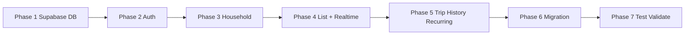

# Shopping Pal — Implementation Plan

| Field | Value |
|-------|-------|
| **Status** | Awaiting approval — **do not implement until explicitly approved** |
| **Source of truth** | [shopping-pal-phase1-design.md](./shopping-pal-phase1-design.md) (approved v1.1 + implementation adjustments) |
| **Note** | Request referenced `shopping-pal-phase1-design-v1.1.md`; canonical file in repo is `shopping-pal-phase1-design.md` |
| **Baseline app** | `breezy-shopping-trip` — TanStack Start, React 19, TanStack Router, Tailwind, `localStorage` via `src/lib/store.tsx` |
| **Target stack** | Same frontend + **Supabase only** (Auth, PostgreSQL, PostgREST, Realtime) |

---

## Out of scope (hard constraints)

Do **not** implement in this plan:

- Multi-household membership or household switcher
- Roles (`owner` / `member`) or role-based UI
- Household deletion (`delete_household`, DELETE on `households` for users)
- Removing another member (only self `leave_household`)
- `invite_code_version` or versioned invite URLs
- Custom backend services, additional databases, Firebase, Socket.io servers
- Pricing, budgets, push notifications, presence, offline CRDT sync

---

## Implementation overview

| Phase | Focus | Depends on |
|-------|--------|------------|
| 1 | Supabase project, schema, RLS, RPCs | — |
| 2 | Google auth, session, route guards | 1 |
| 3 | Create / join / invite / leave / regen | 1, 2 |
| 4 | Shared cart CRUD + Realtime | 1, 2, 3 |
| 5 | Complete trip, history, recurring, carry-over | 4 |
| 6 | localStorage import wizard | 3, 5 |
| 7 | Tests, security, realtime SLA | 1–6 |

---

## Phase 1 — Supabase foundation (schema, RLS, RPCs)

### Goal

Stand up a Supabase project with the full approved data model, security policies, helper functions, RPCs, system product seed, and Realtime publication for `shopping_items` — verifiable without frontend changes.

### Files to create / update

| Action | Path |
|--------|------|
| Create | `supabase/config.toml` (local CLI config) |
| Create | `supabase/migrations/00001_extensions_and_helpers.sql` |
| Create | `supabase/migrations/00002_tables.sql` |
| Create | `supabase/migrations/00003_indexes.sql` |
| Create | `supabase/migrations/00004_rls_policies.sql` |
| Create | `supabase/migrations/00005_rpc_functions.sql` |
| Create | `supabase/migrations/00006_seed_products.sql` |
| Create | `supabase/migrations/00007_realtime_publication.sql` |
| Create | `supabase/tests/rls_policies.test.sql` (pgTAP or SQL script — optional but recommended) |
| Create | `.env.example` |
| Update | `.gitignore` — ignore `.env`, `.env.local` |
| Create | `docs/supabase-setup.md` — manual steps: project creation, Google OAuth in dashboard, redirect URLs |
| Update | `package.json` — add `@supabase/supabase-js`, `supabase` CLI as devDependency (scripts only; no app wiring yet) |

**Do not modify** `src/**` in Phase 1.

### Database changes

**Tables** (all in `public`, RLS enabled):

- `profiles`
- `households` (`invite_code`, `created_by` — **no** `invite_code_version`)
- `household_members` — `UNIQUE (user_id)`, `UNIQUE (household_id, user_id)`
- `products` (system `household_id IS NULL` + household-scoped)
- `shopping_lists` — partial unique index one `active` per household
- `shopping_items` — statuses: `pending`, `purchased`, `unavailable`
- `recurring_products`
- `suggestion_dismissals`

**Helper functions** (SECURITY DEFINER where noted):

- `is_household_member(household_id uuid)`
- `my_household_id() RETURNS uuid`
- `is_household_creator(household_id uuid)`
- `household_id_for_list(list_id uuid)` (for item policies)

**Triggers:**

- `handle_new_user()` on `auth.users` → insert `profiles`
- `updated_at` on mutable tables

**RPCs** (SECURITY DEFINER, `auth.uid()` checks):

| RPC | Behavior |
|-----|----------|
| `create_household(name text)` | Reject if user already has membership; set `created_by`; active list; call `seed_recurring_items` |
| `join_household_by_code(code text)` | Reject if user in other household; idempotent if already in target household |
| `regenerate_invite_code(household_id uuid)` | **Creator only** (`created_by = auth.uid()`) |
| `leave_household()` | Delete **only** caller's `household_members` row |
| `complete_shopping_trip(household_id uuid)` | Per Appendix B: complete → new active → carry `unavailable` → recurring auto-add with merge rule |
| `seed_recurring_items(list_id uuid)` | Internal: insert pending items from enabled `recurring_products` |
| `reuse_list_items(source_list_id uuid)` | Optional: copy items to active list (if implementing reuse via RPC) |

**Seed:**

- Migrate `DEFAULT_CATALOG` from `src/lib/store.tsx` into `00006_seed_products.sql` (~70 Hebrew products, 10 categories)

**Realtime:**

- Add `shopping_items` to `supabase_realtime` publication

**Explicit exclusions in migrations:**

- No `role` column on `household_members`
- No DELETE policy on `households` for `authenticated`
- No `delete_household` function

### Validation criteria

- [ ] `supabase db reset` (local) applies all migrations cleanly
- [ ] Seed produces queryable system `products` (count ~70)
- [ ] `UNIQUE (user_id)` on `household_members` rejects second membership (SQL test)
- [ ] User A cannot `SELECT` household B data (RLS script with two test JWTs or service role + set `request.jwt.claims`)
- [ ] `create_household` + `join_household_by_code` succeed for new users; second household fails with `CONFLICT` / `ALREADY_IN_HOUSEHOLD`
- [ ] Non-creator calling `regenerate_invite_code` fails (`FORBIDDEN`)
- [ ] `complete_shopping_trip` creates new active list, carries unavailable, merges recurring (same `product_id` — unavailable wins)
- [ ] `leave_household` removes only self; household row remains
- [ ] Realtime enabled: manual INSERT on `shopping_items` visible in Realtime inspector

### Risks

| Risk | Mitigation |
|------|------------|
| RLS policy recursion / helper bugs | Keep helpers STABLE; test matrix per table |
| SECURITY DEFINER RPC over-permission | `SET search_path = public`; explicit `auth.uid()` checks |
| Invite code collision | Use Crockford Base32 loop until unique |
| Seed migration size | Single idempotent `INSERT ... ON CONFLICT DO NOTHING` |

---

## Phase 2 — Authentication and route protection

### Goal

Google Sign-In via Supabase Auth (PKCE), session persistence, profile bootstrap, and TanStack Router guards that route unauthenticated users to `/login` and users without a household to `/onboarding`.

### Files to create / update

| Action | Path |
|--------|------|
| Create | `src/lib/supabase/client.ts` |
| Create | `src/lib/supabase/types.ts` (generated via `supabase gen types typescript`) |
| Create | `src/lib/auth/AuthProvider.tsx` |
| Create | `src/lib/auth/useSession.ts` |
| Create | `src/lib/auth/requireAuth.ts` (route `beforeLoad` helpers) |
| Create | `src/routes/login.tsx` |
| Create | `src/routes/auth.callback.tsx` (if needed for OAuth return) |
| Update | `src/routes/__root.tsx` — wrap with `AuthProvider`; remove or gate `AppStateProvider` behind feature flag later |
| Update | `src/router.tsx` — ensure error component Hebrew (optional polish) |
| Update | `.env.example` — `VITE_SUPABASE_URL`, `VITE_SUPABASE_ANON_KEY` |
| Update | `package.json` — wire `@supabase/supabase-js`, `@tanstack/react-query` |
| Create | `src/lib/queryClient.ts` |
| Update | `src/routes/__root.tsx` — `QueryClientProvider` |

**Do not implement** household or cart logic yet.

### Database changes

None (Phase 1 only). Verify Google provider + redirect URLs in Supabase dashboard:

- Site URL / redirect allowlist for dev (`localhost`) and staging/production

### Validation criteria

- [ ] Sign in with Google creates `auth.users` + `profiles` row
- [ ] Refresh preserves session; sign out clears session
- [ ] Unauthenticated visit to `/workspace` redirects to `/login`
- [ ] Authenticated user with no `household_members` row redirects to `/onboarding`
- [ ] No `service_role` key in client bundle (grep build output / env)
- [ ] `onAuthStateChange` does not cause redirect loops

### Risks

| Risk | Mitigation |
|------|------------|
| TanStack Start + OAuth redirect mismatch | Document exact `redirectTo` in `docs/supabase-setup.md`; test early on target host |
| SSR accessing `window` in Supabase client | Browser-only client singleton pattern |
| Profile trigger race on first login | Retry profile fetch or listen for insert |

---

## Phase 3 — Household lifecycle (create, join, invite, leave)

### Goal

Implement onboarding: create household, join by link/code, display invite for sharing, creator-only invite regeneration, self leave — enforcing **one household per user**.

### Files to create / update

| Action | Path |
|--------|------|
| Create | `src/lib/household/HouseholdProvider.tsx` |
| Create | `src/lib/household/useMyHousehold.ts` |
| Create | `src/lib/queries/queryKeys.ts` |
| Create | `src/lib/queries/households.ts` |
| Create | `src/routes/onboarding.tsx` |
| Create | `src/routes/join.tsx` (manual code entry) |
| Create | `src/routes/join.$code.tsx` (invite link) |
| Create | `src/routes/settings.household.tsx` |
| Update | `src/routes/index.tsx` — require auth + household; remove localStorage preview or keep behind flag |
| Update | `src/components/Nav.tsx` — settings link; no household switcher |
| Update | `src/lib/auth/requireAuth.ts` — `requireHousehold`, `requireNoHousehold` (onboarding) |
| Create | `src/lib/household/pendingInvite.ts` — `sessionStorage` key for post-login join resume |

### Database changes

None new — use Phase 1 RPCs. Optional dashboard: rate limiting on `join_household_by_code` (Supabase Edge Function deferred unless required).

### Validation criteria

- [ ] Create household: user lands with `household_members` row, `created_by` set, active list exists
- [ ] Join via `/join/{code}` after login adds membership and routes to `/workspace`
- [ ] Join while already in **another** household shows `ALREADY_IN_HOUSEHOLD` (must leave first)
- [ ] Join same household twice is idempotent
- [ ] Creator sees "Regenerate invite"; non-creator does not (UI + API 403)
- [ ] Old invite code invalid after regen
- [ ] `leave_household` routes to `/onboarding`; user can create/join again
- [ ] Any member can copy/share invite link text (read-only)
- [ ] No UI for delete household or remove other member

### Risks

| Risk | Mitigation |
|------|------------|
| Pending invite lost on OAuth redirect | `sessionStorage` + resume in `join.$code` / root |
| User creates household while member elsewhere | RPC + unique constraint — show Hebrew error |
| Creator leaves household | `created_by` immutable; orphan household acceptable per design |

---

## Phase 4 — Shared shopping list, item CRUD, Realtime

### Goal

Replace `localStorage` cart on `/workspace` with Supabase-backed `shopping_items` on the household active list; sync mutations in **&lt; 3s** via Realtime `postgres_changes` filtered by `list_id`.

### Files to create / update

| Action | Path |
|--------|------|
| Create | `src/lib/queries/lists.ts` |
| Create | `src/lib/queries/items.ts` |
| Create | `src/lib/queries/products.ts` |
| Create | `src/lib/hooks/useCart.ts` |
| Create | `src/lib/realtime/useShoppingItemsChannel.ts` |
| Update | `src/routes/workspace.tsx` — major refactor: React Query + mutations; map `collectedIds` → `status = purchased` |
| Update | `src/routes/__root.tsx` — `HouseholdProvider` after auth |
| Deprecate (later remove) | `src/lib/store.tsx` usage in workspace — feature flag `VITE_USE_SUPABASE=true` |
| Delete (Phase 6) | `src/lib/shopping.ts` (dead code) |

### Database changes

None new. Confirm RLS allows member CRUD on `shopping_items` for active list only (optional stricter INSERT policy).

Optional RPC (design): `upsert_cart_item(list_id, product_id, qty_delta)` — implement only if direct UPDATE/INSERT race conditions appear in testing.

### Validation criteria

- [ ] Two browsers, same household: add item on A → appears on B within **3s** (p95 target)
- [ ] Update quantity, remove item, mark `purchased` sync across clients
- [ ] User not in household cannot read/write items (403 / empty)
- [ ] Category grid loads system + household `products`
- [ ] Quick-add creates household `product` + line item (any member)
- [ ] Realtime subscription uses `list_id=eq.{activeListId}`; unsubscribes on route leave
- [ ] Optimistic updates roll back on error
- [ ] Purchased items show struck-through (per design default)

### Risks

| Risk | Mitigation |
|------|------------|
| Realtime filter misconfiguration | Log channel status; fallback refetch on `CHANNEL_ERROR` |
| Cache desync after burst events | Debounce patches 100–200ms after `complete_shopping_trip` (Phase 5) |
| Duplicate `product_id` on list | Handle `CONFLICT`; upsert pattern in mutation |
| Large join payloads | Select explicit columns + `products(name, category)` embed |

---

## Phase 5 — Complete trip, history, recurring, carry-over

### Goal

Implement end-to-end shopping cycle: finish trip RPC (unavailable carry-over + recurring auto-add), unlimited history with cursor pagination, recurring products CRUD in settings, smart suggestions, reuse list from history.

### Files to create / update

| Action | Path |
|--------|------|
| Create | `src/lib/queries/history.ts` |
| Create | `src/lib/queries/recurring.ts` |
| Create | `src/lib/queries/suggestions.ts` |
| Create | `src/lib/hooks/useCompleteTrip.ts` |
| Update | `src/routes/workspace.tsx` — finish flow, leftover modal → `unavailable` + RPC; suggestions chips |
| Update | `src/routes/history.tsx` — Supabase completed lists, infinite scroll, reuse list |
| Update | `src/routes/settings.household.tsx` — recurring products UI; household name update |
| Create | `src/lib/realtime/useShoppingListChannel.ts` (optional) — listen for active list replacement on trip complete |
| Update | `src/lib/realtime/useShoppingItemsChannel.ts` — re-subscribe when `list_id` changes |

### Database changes

None new if Phase 1 `complete_shopping_trip` + `seed_recurring_items` complete.

Verify merge rule in RPC:

- Unavailable carry-over and recurring share `product_id` → **one row**, unavailable quantity preserved, skip duplicate recurring insert.

Implement **reuse list** via:

- Client-side batch insert to active list, or
- `reuse_list_items(source_list_id)` RPC (add in Phase 1 or here if missing)

### Validation criteria

- [ ] Complete trip: active list → `completed`; new active list exists
- [ ] Unavailable items appear as `pending` on new list
- [ ] Enabled recurring products auto-added with `default_quantity`
- [ ] Merge rule: product both unavailable and recurring → single row
- [ ] Realtime clients re-subscribe to new `list_id`; cart UI resets correctly
- [ ] History lists all completed trips (no cap); pagination loads more
- [ ] Reuse list copies items into current active list
- [ ] Recurring CRUD in settings affects **next** cycle (and create household seed)
- [ ] Smart suggestions respect `suggestion_dismissals` and history frequency (port logic from current `workspace.tsx`)

### Risks

| Risk | Mitigation |
|------|------------|
| Bulk INSERT realtime storm | Debounce cache merge; show brief loading on trip complete |
| Reuse list duplicates active items | Upsert on `(list_id, product_id)` |
| History query slow over years | Index `(household_id, status, completed_at DESC)`; cursor by `completed_at, id` |

---

## Phase 6 — Migration wizard (localStorage import)

### Goal

One-time import of `shoplist:state:v1` when user **creates** a new household (skip if joining existing household); map legacy IDs to UUID products; import unlimited history; mark migrated.

### Files to create / update

| Action | Path |
|--------|------|
| Create | `src/lib/migration/types.ts` — legacy `AppState` shape |
| Create | `src/lib/migration/readLocalState.ts` |
| Create | `src/lib/migration/mapProducts.ts` — `sys-*` / `usr-*` → UUID by name+category |
| Create | `src/lib/migration/importToSupabase.ts` |
| Create | `src/routes/migrate.tsx` or modal in `onboarding.tsx` |
| Update | `src/routes/onboarding.tsx` — detect `shoplist:state:v1`, offer import on create path |
| Update | `src/routes/__root.tsx` — remove `AppStateProvider` when `VITE_USE_SUPABASE=true` |
| Remove | `src/lib/store.tsx` (after validation) |
| Remove | `src/lib/shopping.ts` |

### Database changes

None new. Import uses standard inserts/RPCs:

- Active `selectedItems` → `shopping_items` on active list
- `shoppingLists[]` → `shopping_lists` completed + items (no count cap)
- `userProducts[]` → `products` with `household_id`
- `dismissedSuggestions` → `suggestion_dismissals`

### Validation criteria

- [ ] Fresh user with local data: create household → import offers → data visible in workspace/history
- [ ] Join existing household: import **skipped** (export-only or dismiss)
- [ ] After success: key renamed to `shoplist:state:v1:migrated`
- [ ] No writes to `shoplist:state:v1` after cutover
- [ ] `collectedIds` not in localStorage — only map to `purchased` if import runs mid-session (document limitation)
- [ ] All historical lists imported (test with &gt;10 legacy lists)

### Risks

| Risk | Mitigation |
|------|------------|
| Product name collisions on map | Use `normalized_name` + household scope |
| Import partial failure | Transaction per list or rollback + retry UI |
| Multi-device legacy data | Copy explains each device imports into same household manually |

---

## Phase 7 — Testing, security, and realtime validation

### Goal

Prove correctness, security boundaries, and realtime SLA before production cutover.

### Files to create / update

| Action | Path |
|--------|------|
| Create | `supabase/tests/rls_household_isolation.sql` |
| Create | `supabase/tests/rpc_household_lifecycle.sql` |
| Create | `e2e/auth.spec.ts` (Playwright — optional) |
| Create | `e2e/realtime-sync.spec.ts` — two contexts, one household |
| Create | `docs/qa-checklist.md` |
| Update | `package.json` — test scripts |
| Update | `shopping-pal-phase1-design.md` — link to PLAN.md only if desired |

### Database changes

None — run tests against local/staging Supabase.

### Validation criteria

**Security**

- [ ] Cross-household read/write denied on all tables (automated SQL tests)
- [ ] Anon key cannot call `create_household` without JWT
- [ ] Non-creator `regenerate_invite_code` denied
- [ ] No DELETE on `households` via PostgREST for authenticated role
- [ ] Cannot delete another user's `household_members` row

**Realtime**

- [ ] p95 propagation &lt; 3s on staging (manual or scripted two-tab test)
- [ ] Trip complete re-subscription works under load (10+ recurring items)

**Regression**

- [ ] `npm run build` succeeds
- [ ] `npm run lint` passes
- [ ] Core Hebrew RTL flows: login → create → add → purchase → complete → history

**Migration**

- [ ] Import sample `shoplist:state:v1` fixture end-to-end

### Risks

| Risk | Mitigation |
|------|------------|
| Flaky e2e Realtime | Retry assertions; increase timeout; run on staging |
| CI without Supabase | Use `supabase start` in CI or skip e2e with label |

---

## Architecture compliance checklist

Use before marking Phase 7 complete. Each item must be **true**.

### Tenancy and membership

- [ ] **ADR-11** — `UNIQUE (user_id)` on `household_members`; no multi-household UI
- [ ] **ADR-12** — No `role` column; no owner/member permissions except creator check
- [ ] **ADR-17** — `regenerate_invite_code` only when `households.created_by = auth.uid()`
- [ ] **ADR-18** — No remove-other-member; only `leave_household` for self
- [ ] **ADR-19** — No household deletion RPC, RLS DELETE, or UI

### Data model

- [ ] One `active` `shopping_lists` row per household (partial unique index)
- [ ] `shopping_items.status` ∈ `pending`, `purchased`, `unavailable`
- [ ] No `invite_code_version` column or query param
- [ ] **ADR-13** — History has no retention cap; UI paginates only
- [ ] **ADR-14** — Recurring auto-add on `create_household` and `complete_shopping_trip`
- [ ] **ADR-15** — Any member CRUD on household `products` and `recurring_products`

### Backend boundaries

- [ ] **ADR-02** — Supabase only; no custom API server
- [ ] Anon key in frontend only; service role never shipped
- [ ] Household create/join via SECURITY DEFINER RPCs, not open INSERT on `household_members`

### Realtime and sync

- [ ] **ADR-07** — Subscription filter `list_id=eq.{activeListId}`
- [ ] **ADR-08** — React Query + Realtime cache patch on workspace
- [ ] **ADR-09** — Last-write-wins (no CRDT)

### Frontend stack

- [ ] React + TypeScript + TanStack Router + Tailwind (no stack substitution)
- [ ] Google Sign-In only for Phase 1 auth
- [ ] RTL Hebrew UX preserved on main routes

### Migration

- [ ] **ADR-10** — One-time wizard; not continuous dual-write
- [ ] Join path skips local import; create path imports all history

### Explicit non-features (must remain absent)

- [ ] Household switcher
- [ ] Role-based UI or `owner`/`member` strings in code
- [ ] Delete household button
- [ ] Remove member button
- [ ] Second database or backend service

---

## Open questions (for approval before / during implementation)

Resolved defaults from design doc are shown; confirm or override before coding affected phase.

| # | Question | Design default | Blocks phase | Recommendation |
|---|----------|----------------|--------------|----------------|
| 1 | **Deployment host** for OAuth redirects (TanStack Start on Cloudflare vs static) | Spike required | 2 | Run OAuth spike in Phase 2 week 1 |
| 2 | **Starter recurring set** on household create | Optional onboarding | 3, 5 | Phase 5: start empty recurring; user adds in settings |
| 3 | **`reuse_list_items`** — RPC vs client batch inserts | Design allows either | 5 | RPC for atomicity if &gt;20 items typical |
| 4 | **`upsert_cart_item` RPC** | Optional | 4 | Start with direct PostgREST; add RPC if race tests fail |
| 5 | **Purchased items UX** | Struck-through | 4 | Implement struck-through |
| 6 | **Rate limit** `join_household_by_code` | Mentioned in risks | 3 | 8+ char code + Supabase dashboard rate limits; defer Edge Function unless abuse seen |
| 7 | **Feature flag** `VITE_USE_SUPABASE` during transition | Not in design | 4–6 | Use flag until Phase 6 removes `store.tsx` |
| 8 | **Rename design file** to `shopping-pal-phase1-design-v1.1.md` | User referenced alternate name | — | Optional docs-only rename for clarity |

**Closed — do not reopen without design amendment:**

- Multi-household, roles, household deletion, remove-other-member, `invite_code_version`

---

## Post-approval workflow

1. Reviewer approves this `PLAN.md` explicitly (e.g. "approved — start Phase 1").
2. Implement **one phase at a time**; do not start phase N+1 until validation criteria for phase N pass.
3. Update checkboxes in this file as phases complete (optional tracking).
4. Any scope change requires updating [shopping-pal-phase1-design.md](./shopping-pal-phase1-design.md) first, then revising this plan.

---

## Stop gate

**Implementation must not begin until this plan is approved.**

After approval, first executable work is **Phase 1 only** (Supabase migrations and project setup) — no `src/` application changes until Phase 2 unless explicitly agreed for parallel env wiring.

---

*Generated from approved design v1.1. No application code, migrations, or Supabase resources have been created.*
