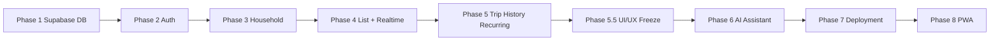

# Shopping Pal — Implementation Plan

| Field | Value |
|-------|-------|
| **Status** | Awaiting approval — **do not implement until explicitly approved** |
| **Source of truth** | [shopping-pal-phase1-design.md](./shopping-pal-phase1-design.md) (approved v1.1 + implementation adjustments) |
| **Note** | Request referenced `shopping-pal-phase1-design-v1.1.md`; canonical file in repo is `shopping-pal-phase1-design.md` |
| **Baseline app** | `breezy-shopping-trip` — TanStack Start, React 19, TanStack Router, Tailwind, `localStorage` via `src/lib/store.tsx` |
| **Target stack** | Same frontend + **Supabase only** (Auth, PostgreSQL, PostgREST, Realtime) |

---

## Out of scope (hard constraints)

Do **not** implement in this plan:

- Multi-household membership or household switcher
- Roles (`owner` / `member`) or role-based UI
- Household deletion (`delete_household`, DELETE on `households` for users)
- Removing another member (only self `leave_household`)
- `invite_code_version` or versioned invite URLs
- Custom backend services, additional databases, Firebase, Socket.io servers
- Pricing, budgets, push notifications, presence, offline CRDT sync

---

## Password policy

These rules apply globally — to registration, login, and change-password flows — and must be kept in sync between the frontend and the Supabase authentication configuration.

| Rule | Requirement |
|------|-------------|
| Minimum length | **6 characters** |
| Uppercase letters | Not required |
| Lowercase letters | Not required |
| Numbers | Not required |
| Special characters | Not required |

**Implementation constraint:** Frontend validation (`MIN_PASSWORD_LENGTH`) must always equal the Supabase Auth setting (Authentication → Settings → "Minimum password length"). If either is changed, both must be updated together.

---

## Implementation overview



| Phase | Focus | Depends on |
|-------|--------|------------|
| 1 | Supabase project, schema, RLS, RPCs | — |
| 2 | Google auth, session, route guards | 1 |
| 3 | Create / join / invite / leave / regen | 1, 2 |
| 4 | Shared cart CRUD + Realtime | 1, 2, 3 |
| 5 | Complete trip, history, recurring, carry-over | 4 |
| 5.5 | UI / UX freeze — final polish, responsive, accessibility | 5 |
| 6 | AI Shopping Assistant (6.0 Infrastructure → 6.1 Chat → 6.2 Actions → 6.3 Smart) | 5, 5.5 |
| 7 | Deployment — production infrastructure | 6 |
| 8 | Progressive Web App — installable mobile app | 7 |

---

## Phase 1 — Supabase foundation (schema, RLS, RPCs)

### Goal

Stand up a Supabase project with the full approved data model, security policies, helper functions, RPCs, system product seed, and Realtime publication for `shopping_items` — verifiable without frontend changes.

### Files to create / update

| Action | Path |
|--------|------|
| Create | `supabase/config.toml` (local CLI config) |
| Create | `supabase/migrations/00001_extensions_and_helpers.sql` |
| Create | `supabase/migrations/00002_tables.sql` |
| Create | `supabase/migrations/00003_indexes.sql` |
| Create | `supabase/migrations/00004_rls_policies.sql` |
| Create | `supabase/migrations/00005_rpc_functions.sql` |
| Create | `supabase/migrations/00006_seed_products.sql` |
| Create | `supabase/migrations/00007_realtime_publication.sql` |
| Create | `supabase/tests/rls_policies.test.sql` (pgTAP or SQL script — optional but recommended) |
| Create | `.env.example` |
| Update | `.gitignore` — ignore `.env`, `.env.local` |
| Create | `docs/supabase-setup.md` — manual steps: project creation, Google OAuth in dashboard, redirect URLs |
| Update | `package.json` — add `@supabase/supabase-js`, `supabase` CLI as devDependency (scripts only; no app wiring yet) |

**Do not modify** `src/**` in Phase 1.

### Database changes

**Tables** (all in `public`, RLS enabled):

- `profiles`
- `households` (`invite_code`, `created_by` — **no** `invite_code_version`)
- `household_members` — `UNIQUE (user_id)`, `UNIQUE (household_id, user_id)`
- `products` (system `household_id IS NULL` + household-scoped)
- `shopping_lists` — partial unique index one `active` per household
- `shopping_items` — statuses: `pending`, `purchased`, `unavailable`
- `recurring_products`
- `suggestion_dismissals`

**Helper functions** (SECURITY DEFINER where noted):

- `is_household_member(household_id uuid)`
- `my_household_id() RETURNS uuid`
- `is_household_creator(household_id uuid)`
- `household_id_for_list(list_id uuid)` (for item policies)

**Triggers:**

- `handle_new_user()` on `auth.users` → insert `profiles`
- `updated_at` on mutable tables

**RPCs** (SECURITY DEFINER, `auth.uid()` checks):

| RPC | Behavior |
|-----|----------|
| `create_household(name text)` | Reject if user already has membership; set `created_by`; active list; call `seed_recurring_items` |
| `join_household_by_code(code text)` | Reject if user in other household; idempotent if already in target household |
| `regenerate_invite_code(household_id uuid)` | **Creator only** (`created_by = auth.uid()`) |
| `leave_household()` | Delete **only** caller's `household_members` row |
| `complete_shopping_trip(household_id uuid)` | Per Appendix B: complete → new active → carry `unavailable` → recurring auto-add with merge rule |
| `seed_recurring_items(list_id uuid)` | Internal: insert pending items from enabled `recurring_products` |
| `reuse_list_items(source_list_id uuid)` | Optional: copy items to active list (if implementing reuse via RPC) |

**Seed:**

- Migrate `DEFAULT_CATALOG` from `src/lib/store.tsx` into `00006_seed_products.sql` (~70 Hebrew products, 10 categories)

**Realtime:**

- Add `shopping_items` to `supabase_realtime` publication

**Explicit exclusions in migrations:**

- No `role` column on `household_members`
- No DELETE policy on `households` for `authenticated`
- No `delete_household` function

### Validation criteria

- [ ] `supabase db reset` (local) applies all migrations cleanly
- [ ] Seed produces queryable system `products` (count ~70)
- [ ] `UNIQUE (user_id)` on `household_members` rejects second membership (SQL test)
- [ ] User A cannot `SELECT` household B data (RLS script with two test JWTs or service role + set `request.jwt.claims`)
- [ ] `create_household` + `join_household_by_code` succeed for new users; second household fails with `CONFLICT` / `ALREADY_IN_HOUSEHOLD`
- [ ] Non-creator calling `regenerate_invite_code` fails (`FORBIDDEN`)
- [ ] `complete_shopping_trip` creates new active list, carries unavailable, merges recurring (same `product_id` — unavailable wins)
- [ ] `leave_household` removes only self; household row remains
- [ ] Realtime enabled: manual INSERT on `shopping_items` visible in Realtime inspector

### Risks

| Risk | Mitigation |
|------|------------|
| RLS policy recursion / helper bugs | Keep helpers STABLE; test matrix per table |
| SECURITY DEFINER RPC over-permission | `SET search_path = public`; explicit `auth.uid()` checks |
| Invite code collision | Use Crockford Base32 loop until unique |
| Seed migration size | Single idempotent `INSERT ... ON CONFLICT DO NOTHING` |

---

## Phase 2 — Authentication and route protection

### Goal

Google Sign-In via Supabase Auth (PKCE), session persistence, profile bootstrap, and TanStack Router guards that route unauthenticated users to `/login` and users without a household to `/onboarding`.

### Files to create / update

| Action | Path |
|--------|------|
| Create | `src/lib/supabase/client.ts` |
| Create | `src/lib/supabase/types.ts` (generated via `supabase gen types typescript`) |
| Create | `src/lib/auth/AuthProvider.tsx` |
| Create | `src/lib/auth/useSession.ts` |
| Create | `src/lib/auth/requireAuth.ts` (route `beforeLoad` helpers) |
| Create | `src/routes/login.tsx` |
| Create | `src/routes/auth.callback.tsx` (if needed for OAuth return) |
| Update | `src/routes/__root.tsx` — wrap with `AuthProvider`; remove or gate `AppStateProvider` behind feature flag later |
| Update | `src/router.tsx` — ensure error component Hebrew (optional polish) |
| Update | `.env.example` — `VITE_SUPABASE_URL`, `VITE_SUPABASE_ANON_KEY` |
| Update | `package.json` — wire `@supabase/supabase-js`, `@tanstack/react-query` |
| Create | `src/lib/queryClient.ts` |
| Update | `src/routes/__root.tsx` — `QueryClientProvider` |

**Do not implement** household or cart logic yet.

### Database changes

None (Phase 1 only). Verify Google provider + redirect URLs in Supabase dashboard:

- Site URL / redirect allowlist for dev (`localhost`) and staging/production

### Validation criteria

- [ ] Sign in with Google creates `auth.users` + `profiles` row
- [ ] Refresh preserves session; sign out clears session
- [ ] Unauthenticated visit to `/workspace` redirects to `/login`
- [ ] Authenticated user with no `household_members` row redirects to `/onboarding`
- [ ] No `service_role` key in client bundle (grep build output / env)
- [ ] `onAuthStateChange` does not cause redirect loops

### Risks

| Risk | Mitigation |
|------|------------|
| TanStack Start + OAuth redirect mismatch | Document exact `redirectTo` in `docs/supabase-setup.md`; test early on target host |
| SSR accessing `window` in Supabase client | Browser-only client singleton pattern |
| Profile trigger race on first login | Retry profile fetch or listen for insert |

---

## Phase 3 — Household lifecycle (create, join, invite, leave)

### Goal

Implement onboarding: create household, join by link/code, display invite for sharing, creator-only invite regeneration, self leave — enforcing **one household per user**.

### Files to create / update

| Action | Path |
|--------|------|
| Create | `src/lib/household/HouseholdProvider.tsx` |
| Create | `src/lib/household/useMyHousehold.ts` |
| Create | `src/lib/queries/queryKeys.ts` |
| Create | `src/lib/queries/households.ts` |
| Create | `src/routes/onboarding.tsx` |
| Create | `src/routes/join.tsx` (manual code entry) |
| Create | `src/routes/join.$code.tsx` (invite link) |
| Create | `src/routes/settings.household.tsx` |
| Update | `src/routes/index.tsx` — require auth + household; remove localStorage preview or keep behind flag |
| Update | `src/components/Nav.tsx` — settings link; no household switcher |
| Update | `src/lib/auth/requireAuth.ts` — `requireHousehold`, `requireNoHousehold` (onboarding) |
| Create | `src/lib/household/pendingInvite.ts` — `sessionStorage` key for post-login join resume |

### Database changes

None new — use Phase 1 RPCs. Optional dashboard: rate limiting on `join_household_by_code` (Supabase Edge Function deferred unless required).

### Validation criteria

- [ ] Create household: user lands with `household_members` row, `created_by` set, active list exists
- [ ] Join via `/join/{code}` after login adds membership and routes to `/workspace`
- [ ] Join while already in **another** household shows `ALREADY_IN_HOUSEHOLD` (must leave first)
- [ ] Join same household twice is idempotent
- [ ] Creator sees "Regenerate invite"; non-creator does not (UI + API 403)
- [ ] Old invite code invalid after regen
- [ ] `leave_household` routes to `/onboarding`; user can create/join again
- [ ] Any member can copy/share invite link text (read-only)
- [ ] No UI for delete household or remove other member

### Risks

| Risk | Mitigation |
|------|------------|
| Pending invite lost on OAuth redirect | `sessionStorage` + resume in `join.$code` / root |
| User creates household while member elsewhere | RPC + unique constraint — show Hebrew error |
| Creator leaves household | `created_by` immutable; orphan household acceptable per design |

---

## Phase 4 — Shared shopping list, item CRUD, Realtime

### Goal

Replace `localStorage` cart on `/workspace` with Supabase-backed `shopping_items` on the household active list; sync mutations in **&lt; 3s** via Realtime `postgres_changes` filtered by `list_id`.

### Files to create / update

| Action | Path |
|--------|------|
| Create | `src/lib/queries/lists.ts` |
| Create | `src/lib/queries/items.ts` |
| Create | `src/lib/queries/products.ts` |
| Create | `src/lib/hooks/useCart.ts` |
| Create | `src/lib/realtime/useShoppingItemsChannel.ts` |
| Update | `src/routes/workspace.tsx` — major refactor: React Query + mutations; map `collectedIds` → `status = purchased` |
| Update | `src/routes/__root.tsx` — `HouseholdProvider` after auth |
| Deprecate (later remove) | `src/lib/store.tsx` usage in workspace — feature flag `VITE_USE_SUPABASE=true` |
| Delete (Phase 6) | `src/lib/shopping.ts` (dead code) |

### Database changes

None new. Confirm RLS allows member CRUD on `shopping_items` for active list only (optional stricter INSERT policy).

Optional RPC (design): `upsert_cart_item(list_id, product_id, qty_delta)` — implement only if direct UPDATE/INSERT race conditions appear in testing.

### Validation criteria

- [ ] Two browsers, same household: add item on A → appears on B within **3s** (p95 target)
- [ ] Update quantity, remove item, mark `purchased` sync across clients
- [ ] User not in household cannot read/write items (403 / empty)
- [ ] Category grid loads system + household `products`
- [ ] Quick-add creates household `product` + line item (any member)
- [ ] Realtime subscription uses `list_id=eq.{activeListId}`; unsubscribes on route leave
- [ ] Optimistic updates roll back on error
- [ ] Purchased items show struck-through (per design default)

### Risks

| Risk | Mitigation |
|------|------------|
| Realtime filter misconfiguration | Log channel status; fallback refetch on `CHANNEL_ERROR` |
| Cache desync after burst events | Debounce patches 100–200ms after `complete_shopping_trip` (Phase 5) |
| Duplicate `product_id` on list | Handle `CONFLICT`; upsert pattern in mutation |
| Large join payloads | Select explicit columns + `products(name, category)` embed |

---

## Phase 5 — Shopping trip completion, history, recurring, carry-over

### Goal

Implement the shopping item lifecycle and trip completion flow: a user-driven "סיימנו קניות" action that archives purchased items into history, carries unavailable items forward, creates the next active list, and auto-adds recurring products. No timer-based deletion — the lifecycle is driven entirely by business events.

### Shopping item lifecycle

```
                ┌──[✓ נקנה]───► purchased ──[החזר לממתין]──┐
                │                                           │
  pending ◄─────┤                                           ├──► pending
                │                                           │
                └──[לא נמצא]──► unavailable ─[החזר לממתין]──┘
```

**Purchased items** remain visible on the active list (green, struck-through) until the household explicitly completes the shopping trip. They are **not** automatically removed or hidden by any timer.

**Unavailable items** remain visible on the active list (orange) until the trip is completed, at which point they carry over to the next list as `pending`.

### Trip completion flow ("סיימנו קניות")

When a household member presses the "סיימנו קניות" button:

1. **Archive**: set current active list status → `completed`, record `completed_at`
2. **History**: all items on the completed list (purchased + unavailable + any remaining pending) are preserved as-is in the archived list for history viewing
3. **New list**: create a new `shopping_lists` row with `status = 'active'` for the household
4. **Carry-over unavailable**: copy all items with `status = 'unavailable'` from the completed list into the new active list as `pending`
5. **Recurring auto-add**: insert enabled `recurring_products` into the new list with `default_quantity` (skip if product already carried over from unavailable — unavailable wins, quantity preserved)
6. **No timer**: there is no 24-hour expiry, no automatic deletion, no scheduled cleanup — the cycle advances only when a user triggers it

### Pending Items Review

If any items have `status = 'pending'` when the user presses "המשך" in the initial confirmation dialog, the trip **must not complete** immediately. Instead, display a dialog listing every pending product by name:

**Title:** "יש מוצרים שלא סומנו"

**Body:** "המוצרים הבאים עדיין לא סומנו. מה תרצה לעשות?"

| Option | Hebrew label | Behavior |
|--------|-------------|----------|
| Carry pending items to next list | העבר לרשימה הבאה | Pending items copy forward as `pending` in the new list |
| Remove pending items | אל תעביר | Pending items are NOT carried; they exist only in history |
| Return to list | חזור לרשימה | Dismiss the dialog; the trip remains open |

**Constraints:**
- Resolved only after this dialog. If unavailable items also exist, the Unavailable Items Review follows.
- "חזור לרשימה" closes the dialog only — no server call, no state change.
- If no pending items exist, this dialog is skipped entirely.

### Unavailable Items Review

Shown **after** the Pending Items Review (if pending items existed) or immediately after the initial confirmation (if no pending items). If any items have `status = 'unavailable'`, the trip must not complete until the user chooses:

| Option | Hebrew label | Behavior |
|--------|-------------|----------|
| Carry unavailable items to next list | העבר לרשימה הבאה | Unavailable items copy forward as `pending` (quantity preserved) |
| Remove unavailable items | אל תעביר | Unavailable items are NOT carried; they exist only in history |
| Cancel | ביטול | Dismiss the dialog and return to the active list; the trip remains open |

**Constraints:**
- The trip completion RPC must not be called until the user makes a choice (carry or remove) in every required review dialog.
- "ביטול" closes the dialog only — no server call, no state change.
- If no unavailable items exist, this dialog is skipped entirely.

### RPC contract

`complete_shopping_trip(p_household_id, p_active_list_id, p_carry_pending, p_carry_unavailable)` — single PostgreSQL transaction.

| Parameter | Type | Meaning |
|-----------|------|---------|
| `p_household_id` | uuid | The household performing the completion |
| `p_active_list_id` | uuid | The list being archived (race-condition guard) |
| `p_carry_pending` | boolean | If true, copy `pending` items to new list |
| `p_carry_unavailable` | boolean | If true, copy `unavailable` items to new list as `pending` |

Returns `jsonb { new_list_id, archived_list_id }`.

### Success toast

After the RPC succeeds, display a temporary toast:

- If `carry_unavailable = true`: "הקניות הסתיימו בהצלחה! רשימה חדשה נוצרה והמוצרים שלא נמצאו הועברו אליה."
- Otherwise: "הקניות הסתיימו בהצלחה! רשימת קניות חדשה נוצרה."

### Files to create / update

| Action | Path |
|--------|------|
| Create | `src/lib/queries/history.ts` |
| Create | `src/lib/queries/recurring.ts` |
| Create | `src/lib/queries/suggestions.ts` |
| Create | `src/lib/hooks/useCompleteTrip.ts` |
| Update | `src/routes/workspace.tsx` — "סיימנו קניות" button; confirmation dialog; purchased items remain visible until trip completion |
| Update | `src/routes/history.tsx` — Supabase completed lists, infinite scroll, reuse list |
| Update | `src/routes/settings.household.tsx` — recurring products UI; household name update |
| Create | `src/lib/realtime/useShoppingListChannel.ts` (optional) — listen for active list replacement on trip complete |
| Update | `src/lib/realtime/useShoppingItemsChannel.ts` — re-subscribe when `list_id` changes |

### Database changes

None new if Phase 1 `complete_shopping_trip` + `seed_recurring_items` complete.

Verify `complete_shopping_trip` RPC implements the exact flow above:

- Sets active list → `completed` with `completed_at = now()`
- Creates new active list for the household
- Copies `unavailable` items to new list as `pending` (preserving `product_id` and `quantity`)
- Inserts enabled `recurring_products` with merge rule: if `product_id` already carried over from unavailable, skip the recurring insert (unavailable quantity wins)
- **No timer or scheduled deletion logic**

Implement **reuse list** via:

- Client-side batch insert to active list, or
- `reuse_list_items(source_list_id)` RPC (add in Phase 1 or here if missing)

### Validation criteria

- [ ] Purchased items remain visible on the active list until trip is completed (no auto-removal)
- [ ] All household members can see purchased and unavailable items on the active list
- [ ] "סיימנו קניות" button triggers completion flow with confirmation dialog
- [ ] Pending Items Review dialog appears only when pending items exist
- [ ] Pending Items Review lists all pending products by name
- [ ] Choosing "העבר לרשימה הבאה" (pending) copies pending items to the new list as `pending`
- [ ] Choosing "אל תעביר" (pending) excludes pending items from the new list (history only)
- [ ] Choosing "חזור לרשימה" closes the dialog without any server call; the trip stays open
- [ ] If no pending items exist, the Pending Items Review is skipped
- [ ] If unavailable items exist, the Unavailable Items Review dialog is shown after resolving pending items
- [ ] Unavailable Items Review lists all unavailable products by name
- [ ] Choosing "carry" (unavailable) copies unavailable items to the new list as `pending` (quantity preserved)
- [ ] Choosing "remove" (unavailable) excludes unavailable items from the new list (history only)
- [ ] Choosing "cancel" (unavailable) closes the dialog without any server call; the trip stays open
- [ ] If no unavailable items exist, the Unavailable Items Review is skipped
- [ ] Complete trip: active list → `completed` with `completed_at`; new active list exists
- [ ] Unavailable items appear as `pending` on the new active list (quantity preserved) when carry option chosen
- [ ] Purchased items do **not** carry over to the new list
- [ ] Success toast shown after RPC succeeds; message matches the carry_unavailable choice
- [ ] Enabled recurring products auto-added with `default_quantity`
- [ ] Merge rule: product both unavailable and recurring → single row (unavailable quantity wins)
- [ ] No timer-based deletion exists anywhere in the codebase
- [ ] Realtime clients re-subscribe to new `list_id`; cart UI resets correctly
- [ ] History lists all completed trips (no cap); pagination loads more
- [ ] Reuse list copies items into current active list
- [ ] Recurring CRUD in settings affects **next** cycle (and create household seed)
- [ ] Smart suggestions respect `suggestion_dismissals` and history frequency (port logic from current `workspace.tsx`)

### Risks

| Risk | Mitigation |
|------|------------|
| Bulk INSERT realtime storm on trip complete | Debounce cache merge; show brief loading state during completion |
| Reuse list duplicates active items | Upsert on `(list_id, product_id)` |
| History query slow over years | Index `(household_id, status, completed_at DESC)`; cursor by `completed_at, id` |
| Accidental trip completion | Confirmation dialog ("האם לסיים את הקניות?") before executing |
| Concurrent trip completion by two members | RPC uses transaction; second call sees no active list → returns error gracefully |

---

## Phase 5.5 — UI / UX Freeze

### Goals

- Final UI polish
- Bug fixing
- Responsive verification
- Mobile First validation
- Accessibility review
- Architecture freeze

### Constraint

Phase 5.5 changes **zero** application behaviour. Every feature, data flow, auth guard, and Supabase call remains identical. Only the visual and UX layer is refined.

No new features may be introduced after this phase without explicit design approval and a new plan entry.

### Deliverable

Stable MVP — feature complete, visually polished, and ready to hand off to Phase 6.

---

## Phase 6 — AI Shopping Assistant

### Objective

Introduce an AI assistant that helps users manage shopping lists naturally through conversation in Hebrew. The initial AI provider is **Google Gemini**, integrated behind a provider-independent architecture — replacing Gemini with another provider in the future must require changes only inside `provider.ts`.

---

### Phase 6.0 — AI Infrastructure

#### Objective

Prepare the AI architecture before exposing any AI features to users. This phase produces no visible UI changes and no database changes. Its sole output is a stable, tested, provider-independent infrastructure layer that all subsequent AI phases build on.

#### Scope

| Component | Responsibility |
|-----------|---------------|
| AI provider interface | Abstract contract that any AI provider must implement; decouples business logic from vendor. Initial implementation targets **Google Gemini** |
| AI service abstraction | Single entry point for all AI calls; routes through the provider interface; backs the `ai-chat` Supabase Edge Function |
| Prompt Loader | Loads system prompts from Markdown files (e.g. `src/lib/ai/prompts/shopping-pal.md`); prompt strings are never hardcoded inside React components |
| Conversation history | Data structures for messages, roles, and the full conversation log |
| Conversation state | Tracks in-progress, multi-step exchanges (e.g. AI asking a clarifying question before an action can be confirmed) — distinct from conversation history |
| Context Builder | The single source of truth for assembling AI context. Collects the active shopping list, products, categories, reminders, household members, shopping history, conversation history, and conversation state. No React component, hook, or UI layer may build prompts or AI context directly |
| Action Planner | Classifies each AI response into an intent (Question, Add Product, Update Quantity, Remove Product, Recipe, Suggestion) and flags whether user confirmation is required. Never performs mutations. Designated bridge for future Tool Calling (see below) |
| Token usage tracking | Logs input/output tokens per request for cost visibility |
| Error handling | Normalised error types for timeout, rate limit, provider error, and network failure |
| Feature flags | `VITE_AI_ENABLED` flag; AI features are invisible when disabled |
| Configuration management | AI model name, temperature, max tokens — all configurable via environment variables, never hardcoded |
| Backend endpoint | Supabase Edge Function `ai-chat` (`/functions/v1/ai-chat`); the frontend never calls Gemini directly. No additional backend server is introduced — the architecture remains Supabase-only |

#### Files to create

| Action | Path |
|--------|------|
| Create | `src/lib/ai/types.ts` — shared interfaces: `AIProvider`, `AIMessage`, `AIContext`, `AIResponse` |
| Create | `src/lib/ai/config.ts` — reads AI configuration from environment (model, temperature, max tokens, Gemini API key — Edge Function only) |
| Create | `src/lib/ai/provider.ts` — provider interface contract; the only layer permitted to communicate with Gemini |
| Create | `src/lib/ai/service.ts` — AI service abstraction; orchestrates context building, prompt loading, the provider call, and action planning. Backing implementation for the `ai-chat` Supabase Edge Function |
| Create | `src/lib/ai/contextBuilder.ts` — single source of truth for assembling AI context |
| Create | `src/lib/ai/actionPlanner.ts` — classifies AI responses into intents (Question, Add Product, Update Quantity, Remove Product, Recipe, Suggestion); never mutates data |
| Create | `src/lib/ai/promptLoader.ts` — loads and caches Markdown prompt files |
| Create | `src/lib/ai/errors.ts` — normalised AI error types |
| Create | `src/lib/ai/assistantClient.ts` — frontend HTTP client; sends `{ message }` to the `ai-chat` Supabase Edge Function and never talks to Gemini directly |
| Create | `src/lib/ai/prompts/shopping-pal.md` — system prompt, stored as Markdown, not hardcoded |
| Create | `supabase/functions/ai-chat/index.ts` — Supabase Edge Function entry point; invokes `service.ts` |

#### Request flow

```
React Workspace
      ↓
Assistant Panel
      ↓
assistantClient.ts
      ↓
Supabase Edge Function (ai-chat)
      ↓
provider.ts
      ↓
Google Gemini
      ↓
Structured JSON Response
      ↓
Action Planner
      ↓
Existing Application Mutations (only after user confirmation)
```

#### API contract

The AI backend is implemented as a Supabase Edge Function — `ai-chat` (`/functions/v1/ai-chat`). No additional backend server is introduced; the architecture remains Supabase-only.

Request body — the frontend sends only the user's message:

```json
{
  "message": "הוסף חלב"
}
```

The Edge Function is responsible for:
- Building the shopping context (`contextBuilder.ts`) — the single source of truth for AI context
- Loading the system prompt (`promptLoader.ts`)
- Calling Gemini (`provider.ts`) — the only layer permitted to communicate with Gemini
- Parsing the model's response
- Classifying intent (`actionPlanner.ts`)
- Returning structured JSON to the frontend

The Gemini API key exists only inside the Supabase Edge Function's environment variables. It is never available in the browser and never included in the frontend bundle. The frontend communicates only with the Edge Function.

#### Future Tool Calling (architecture note)

The architecture must support future AI Tool Calling. Future providers (including Gemini) may return Tool Calls instead of free-text responses. The Action Planner will become the bridge between Tool Calls and existing application mutations. This capability is **not implemented** during Phase 6.0 — only the architecture must be prepared for it.

#### Database changes

None.

#### Validation criteria

- [ ] No UI changes — zero visible difference to the user
- [ ] No database schema changes
- [ ] No business logic changes
- [ ] The frontend never communicates directly with Gemini — every AI request goes through the `ai-chat` Supabase Edge Function
- [ ] The Gemini API key never reaches the browser
- [ ] Context Builder is the only component assembling AI context — no component, hook, or UI layer builds prompts directly
- [ ] `provider.ts` is the only component communicating with Gemini
- [ ] The `ai-chat` Edge Function returns structured JSON responses
- [ ] `promptLoader.ts` loads system prompts from Markdown files, not inline strings
- [ ] Conversation State supports multi-step dialogs (clarifying question → follow-up answer → confirmation)
- [ ] The architecture is ready for future Tool Calling support (not implemented, but not blocked)
- [ ] Replacing Gemini with another provider requires changes only in `provider.ts` — no changes to `service.ts`, `actionPlanner.ts`, components, or hooks
- [ ] `VITE_AI_ENABLED=false` completely disables AI infrastructure with no runtime errors
- [ ] Token usage is logged per request (console or observability sink)
- [ ] All AI errors are normalised to the types defined in `errors.ts`
- [ ] `npm run build` succeeds
- [ ] `npm run lint` passes

#### Risks

| Risk | Mitigation |
|------|------------|
| Provider lock-in | Enforce the provider interface contract in `types.ts`; `provider.ts` is the only layer permitted to call the Gemini SDK |
| API key exposure | Gemini API key exists only inside the Supabase Edge Function environment; never shipped to the browser or frontend bundle |
| Context exceeding token limit | `contextBuilder.ts` enforces a token budget; truncates history before catalog |
| Action Planner misclassifying intent | Default to "Question" (no mutation) when confidence is low; always require confirmation for ambiguous intents |
| Edge Function cold start latency | Acceptable for chat interactions; monitor and revisit if user-perceived latency becomes an issue |

---

### Phase 6.1 — AI Chat (MVP)

#### Goal

A simple chat interface. The assistant answers questions and understands the user's context. It does **not** perform any actions automatically.

#### Context available to the assistant

- Current shopping list contents
- Product catalog
- Household members
- Shopping notes (reminders)

#### Hard constraints during Phase 6.1

The AI **must not** perform destructive actions automatically. Any action that changes data requires explicit user confirmation.

**Confirmation flow example:**

```
User: "הוסף חלב"
AI:   "להוסיף חלב לרשימת הקניות?"
User: "כן"
      → action executed
```

The Action Planner determines the intent behind each AI response and whether confirmation is required — it never executes the action itself. Mutations still flow through the existing hooks only after the user confirms.

**Multi-step conversation (Conversation State) example:**

```
User: "הוסף חלב"
AI:   "איזה חלב?"
User: "3%"
AI:   "כמה בקבוקים?"
User: "2"
AI:   "להוסיף 2 בקבוקי חלב 3%?"
User: "כן"
      → action executed
```

**Actions the AI must never perform without confirmation:**
- Add, update, or remove products from the shopping list
- Delete any data

**Actions the AI must never perform, period:**
- Complete a shopping trip
- Modify household settings
- Delete products from the catalog

#### Files to create / update

| Action | Path |
|--------|------|
| Create | `src/lib/ai/useAssistant.ts` — React hook for chat state; calls `assistantClient.ts` (created in Phase 6.0) |
| Create | `src/components/AssistantPanel.tsx` — chat UI |
| Update | `src/routes/workspace.tsx` — assistant toggle / panel |

#### Database changes

None required for MVP. Optional: `assistant_messages` table for chat history persistence (deferred to 6.2+).

#### Validation criteria

- [ ] Assistant panel opens and closes without affecting list state
- [ ] Assistant understands and responds in Hebrew
- [ ] Assistant knows the current shopping list contents
- [ ] Assistant knows the product catalog
- [ ] No action is executed without an explicit user confirmation step
- [ ] Frontend sends only `{ message }` to the `ai-chat` Supabase Edge Function — no context, keys, or provider details leave the browser
- [ ] Graceful degradation if AI service is unavailable (error state, no crash)
- [ ] All list mutations go through the existing mutation layer (no direct DB writes)

#### Risks

| Risk | Mitigation |
|------|------------|
| API key exposure | Gemini API key never leaves the Supabase Edge Function; frontend only calls the `ai-chat` Edge Function |
| Hallucinated product names | Resolve against household product catalog before acting |
| Unintended mutations | Require explicit user confirmation for every action; enforced by the Action Planner's confirmation flag |
| Latency | Stream responses; show typing indicator |

---

### Phase 6.2 — AI Shopping Actions

#### Goal

After Phase 6.1 is stable, expand the assistant's capabilities to perform list operations — always with user confirmation.

#### Permitted actions (all require confirmation)

- Add products to the shopping list
- Update product quantities
- Create shopping lists from a recipe the user describes
- Suggest missing products based on history or context

#### Out of scope for 6.2

- Autonomous actions without confirmation
- Completing shopping trips
- Modifying household members or settings

---

### Phase 6.3 — Smart Assistant

#### Goal

Long-term AI capabilities, planned but not yet scoped for implementation.

#### Future capabilities (OUT OF SCOPE for MVP)

- Shopping recommendations based on history
- Recurring product suggestions
- Proactive reminders
- Meal planning integration
- Context awareness across sessions
- Learning household shopping habits

These items require separate planning and approval before implementation begins.

---

## Phase 7 — Deployment

### Objective

Deploy the application publicly on production infrastructure.

### Requirements

- Production Supabase project (separate from development)
- Production environment variables
- Vercel deployment (or equivalent)
- Custom domain support
- Production logging
- Error monitoring
- Performance verification

### Validation criteria

- [ ] Application live on production URL
- [ ] Production Supabase project is isolated from development data
- [ ] Environment variables are set correctly and no dev keys are present
- [ ] Custom domain resolves with valid HTTPS certificate
- [ ] Error monitoring captures and alerts on runtime errors
- [ ] Performance baseline measured and acceptable on mobile
- [ ] All auth redirect URLs updated to production domain

### Risks

| Risk | Mitigation |
|------|------------|
| OAuth redirect mismatch on production | Update Supabase allowed redirect URLs before go-live |
| Dev/prod data bleed | Strict env var separation; production project created fresh |
| Cold start latency on Edge Functions | Warm-up strategy or alternative deployment target |

---

## Phase 8 — Progressive Web App

### Objective

Turn the web application into an installable mobile app for Android and iPhone.

### Scope

- Install prompt on Android and iPhone (Add to Home Screen)
- App icons (all required sizes)
- Splash screen
- Web App Manifest (`manifest.json`)
- Offline support (read-only cache for shopping list during poor connectivity)
- Mobile optimization pass
- Install prompt UI (in-app nudge)

### Explicitly out of scope

- Push notifications
- Background sync
- Native app store distribution (App Store / Google Play)

### Validation criteria

- [ ] App installs successfully on Android Chrome
- [ ] App installs successfully on iOS Safari
- [ ] Installed app shows correct icon and name
- [ ] Splash screen displays on launch
- [ ] Manifest passes Chrome DevTools PWA audit
- [ ] Shopping list remains readable offline (cached data)
- [ ] No console errors during install flow

### Risks

| Risk | Mitigation |
|------|------------|
| iOS PWA limitations (Safari) | Test on real device; document known Safari constraints |
| Service worker caching stale data | Versioned cache keys; network-first strategy for mutations |

---

## AI Principles

These rules apply to all AI features introduced in Phase 6 and beyond. They are architectural constraints, not implementation details.

1. **The AI is an assistant, never an actor.**
   It never performs any action without explicit user confirmation. Every mutation must be approved by the user before it is executed.

2. **The AI must explain before it acts.**
   Before performing any action, the AI must clearly state what it intends to do and receive affirmative confirmation from the user.

3. **All AI actions reuse existing business logic.**
   The AI must never bypass validation, call the database directly, or duplicate mutation logic. Every list operation must go through the same hooks and mutation functions used by the rest of the application.

4. **The AI communicates only through existing APIs and services.**
   No new database write paths, no direct PostgREST calls, no side-channel mutations. The AI is a consumer of the application's existing data layer.

5. **The AI must remain provider-independent.**
   `provider.ts` is the **only** layer allowed to communicate with Google Gemini, running inside the `ai-chat` Supabase Edge Function. Replacing Gemini with another provider must require changes only inside `provider.ts` — never in `service.ts`, `actionPlanner.ts`, business logic, UI, or mutation hooks.

6. **The AI must never bypass existing business logic.**
   Every AI action must execute through the same services, APIs, and validation used by the normal application. There are no AI-specific write paths, no shortcut mutations, and no direct database access from AI code.

---

## AI Permissions

This section defines what the AI is allowed to read, what actions it may request (always with user confirmation), and what is unconditionally forbidden.

### Read — allowed without restriction

The AI may read the following data to build context and answer questions:

| Data | Source |
|------|--------|
| Active shopping list | `shopping_items` on the active list |
| Shopping history | Completed lists via `fetchCompletedLists` |
| Products | Household and system product catalog |
| Categories | `fetchCategories` |
| Shopping notes / reminders | `shopping_notes` on the active list |
| Household members | `household_members` |

The AI reads this data through the existing query layer only. No direct SQL or RPC calls from AI code.

### Confirmed actions — allowed only after explicit user approval

The AI may **propose** the following actions. The action is **not executed** until the user explicitly confirms.

| Action | Confirmation required |
|--------|----------------------|
| Add a product to the shopping list | Yes — user must confirm product name and quantity |
| Update product quantity | Yes — user must confirm new quantity |
| Remove a product from the shopping list | Yes — user must confirm removal |
| Add a reminder (shopping note) | Yes — user must confirm note text |
| Create a shopping list from a recipe | Yes — user must review and confirm each product |

**Confirmation flow (non-negotiable):**
```
AI proposes action → User sees clear description → User confirms → Action executed through existing mutation
```

Silence, ambiguity, or a non-response from the user is **never** treated as confirmation.

### Forbidden actions — unconditionally prohibited

The AI must **never** perform or propose the following, regardless of user instruction:

| Forbidden action | Reason |
|-----------------|--------|
| Complete a shopping trip | Irreversible household state change |
| Delete shopping history | Permanent data loss |
| Delete a household | Permanent data loss |
| Change authentication settings | Security boundary |
| Modify application configuration | Outside AI scope |
| Execute any destructive action without confirmation | AI Principle 1 |
| Bypass existing validation or mutation hooks | AI Principle 6 |
| Access the database directly | AI Principle 4 |

---

## Architecture compliance checklist

Use before marking Phase 8 complete. Each item must be **true**.

### Tenancy and membership

- [ ] **ADR-11** — `UNIQUE (user_id)` on `household_members`; no multi-household UI
- [ ] **ADR-12** — No `role` column; no owner/member permissions except creator check
- [ ] **ADR-17** — `regenerate_invite_code` only when `households.created_by = auth.uid()`
- [ ] **ADR-18** — No remove-other-member; only `leave_household` for self
- [ ] **ADR-19** — No household deletion RPC, RLS DELETE, or UI

### Data model

- [ ] One `active` `shopping_lists` row per household (partial unique index)
- [ ] `shopping_items.status` ∈ `pending`, `purchased`, `unavailable`
- [ ] No `invite_code_version` column or query param
- [ ] **ADR-13** — History has no retention cap; UI paginates only
- [ ] **ADR-14** — Recurring auto-add on `create_household` and `complete_shopping_trip`
- [ ] **ADR-15** — Any member CRUD on household `products` and `recurring_products`

### Shopping item lifecycle

- [ ] Purchased items remain visible on active list until explicit trip completion
- [ ] No timer-based or automatic deletion of purchased items (no 24h expiry)
- [ ] Trip completion is event-driven ("סיימנו קניות"), not scheduled
- [ ] Unavailable items carry over to next list as `pending` on trip completion
- [ ] Purchased items are archived into history on trip completion (not carried over)
- [ ] Merge rule on carry-over: unavailable `product_id` wins over recurring auto-add

### Backend boundaries

- [ ] **ADR-02** — Supabase only; no custom API server
- [ ] Anon key in frontend only; service role never shipped
- [ ] Household create/join via SECURITY DEFINER RPCs, not open INSERT on `household_members`

### Realtime and sync

- [ ] **ADR-07** — Subscription filter `list_id=eq.{activeListId}`
- [ ] **ADR-08** — React Query + Realtime cache patch on workspace
- [ ] **ADR-09** — Last-write-wins (no CRDT)

### Frontend stack

- [ ] React + TypeScript + TanStack Router + Tailwind (no stack substitution)
- [ ] Google Sign-In only for Phase 1 auth
- [ ] RTL Hebrew UX preserved on main routes

### Migration

- [ ] **ADR-10** — One-time wizard; not continuous dual-write
- [ ] Join path skips local import; create path imports all history

### Explicit non-features (must remain absent)

- [ ] Household switcher
- [ ] Role-based UI or `owner`/`member` strings in code
- [ ] Delete household button
- [ ] Remove member button
- [ ] Second database or backend service

---

## Open questions (for approval before / during implementation)

Resolved defaults from design doc are shown; confirm or override before coding affected phase.

| # | Question | Design default | Blocks phase | Recommendation |
|---|----------|----------------|--------------|----------------|
| 1 | **Deployment host** for OAuth redirects (TanStack Start on Cloudflare vs static) | Spike required | 2 | Run OAuth spike in Phase 2 week 1 |
| 2 | **Starter recurring set** on household create | Optional onboarding | 3, 5 | Phase 5: start empty recurring; user adds in settings |
| 3 | **`reuse_list_items`** — RPC vs client batch inserts | Design allows either | 5 | RPC for atomicity if &gt;20 items typical |
| 4 | **`upsert_cart_item` RPC** | Optional | 4 | Start with direct PostgREST; add RPC if race tests fail |
| 5 | **Purchased items UX** | Struck-through | 4 | **Resolved** — struck-through + green; remain visible on active list until explicit trip completion ("סיימנו קניות"); no timer-based removal |
| 6 | **Rate limit** `join_household_by_code` | Mentioned in risks | 3 | 8+ char code + Supabase dashboard rate limits; defer Edge Function unless abuse seen |
| 7 | **Feature flag** `VITE_USE_SUPABASE` during transition | Not in design | 4–6 | Use flag until Phase 6 removes `store.tsx` |
| 8 | **Rename design file** to `shopping-pal-phase1-design-v1.1.md` | User referenced alternate name | — | Optional docs-only rename for clarity |

**Closed — do not reopen without design amendment:**

- Multi-household, roles, household deletion, remove-other-member, `invite_code_version`

---

## Post-approval workflow

1. Reviewer approves this `PLAN.md` explicitly (e.g. "approved — start Phase 1").
2. Implement **one phase at a time**; do not start phase N+1 until validation criteria for phase N pass.
3. Update checkboxes in this file as phases complete (optional tracking).
4. Any scope change requires updating [shopping-pal-phase1-design.md](./shopping-pal-phase1-design.md) first, then revising this plan.

---

## Stop gate

**Implementation must not begin until this plan is approved.**

After approval, first executable work is **Phase 1 only** (Supabase migrations and project setup) — no `src/` application changes until Phase 2 unless explicitly agreed for parallel env wiring.

---

*Generated from approved design v1.1. No application code, migrations, or Supabase resources have been created.*
