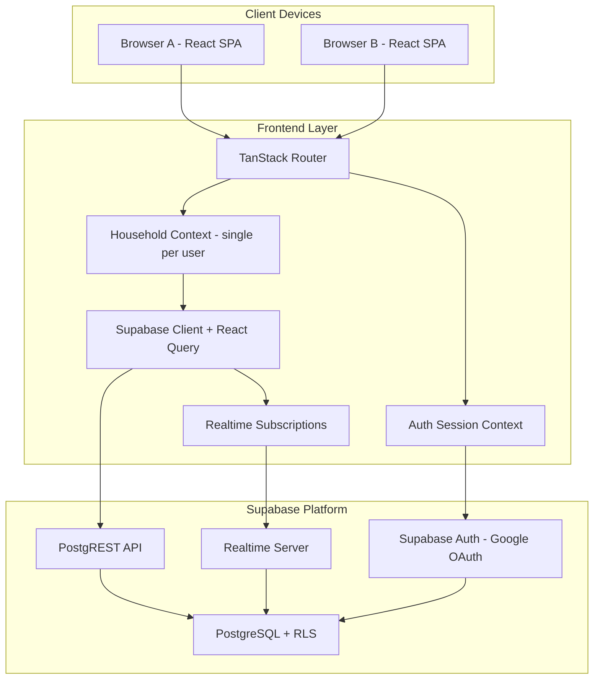
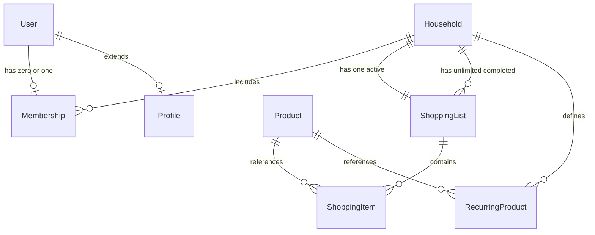
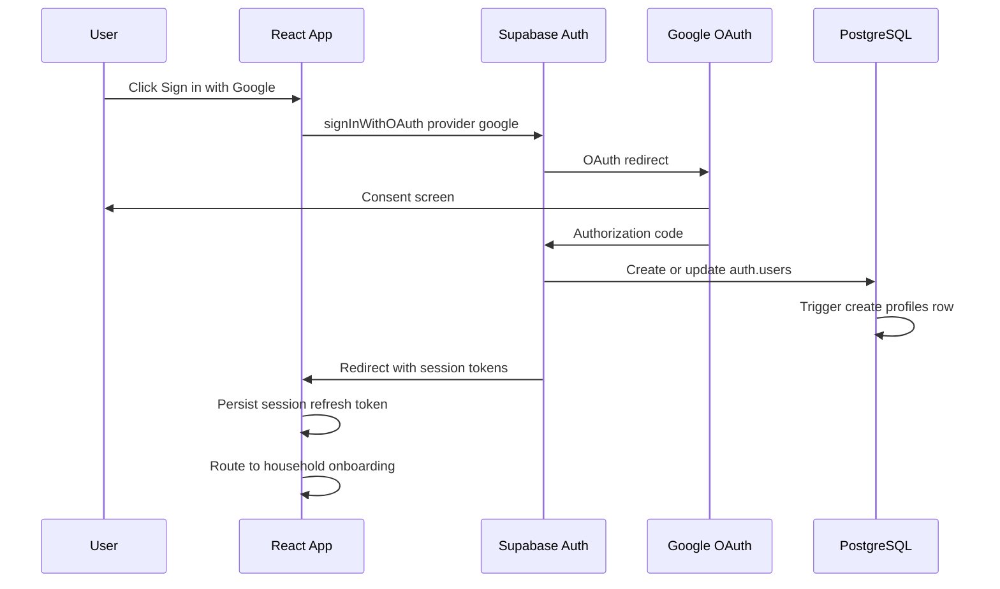
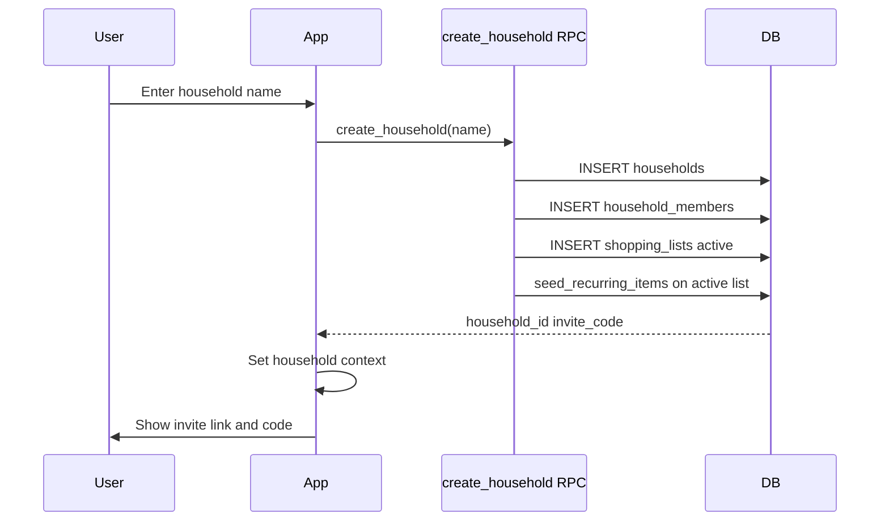
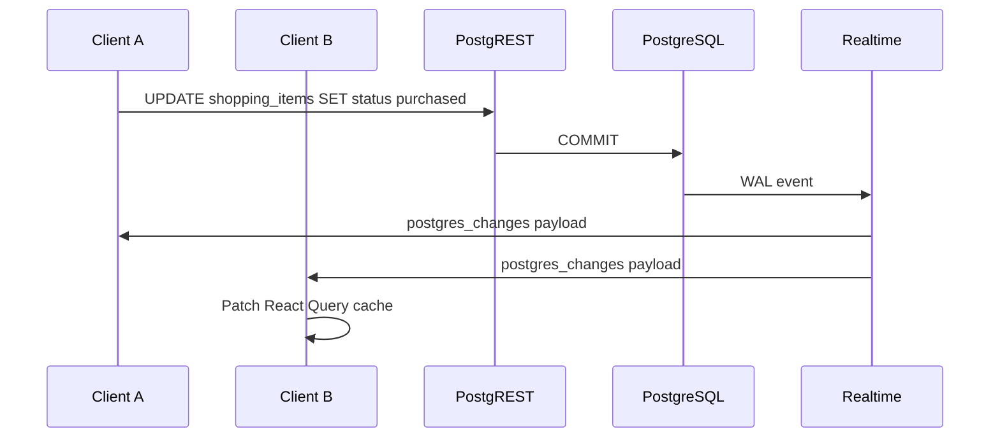
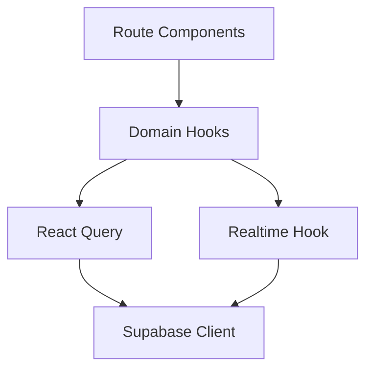
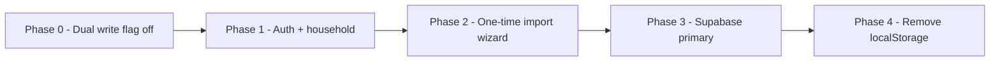

# Shopping Pal — Phase 1 Technical Design (v1.1)

| Field | Value |
|-------|-------|
| **Document** | Phase 1 Technical Design |
| **Version** | **1.1** (revised) |
| **Product** | Shopping Pal |
| **Status** | **Approved for implementation** |
| **Stack** | React, TypeScript, TanStack Router, Tailwind, Supabase (PostgreSQL, Auth, Realtime) |
| **Baseline** | Existing single-user RTL app (`breezy-shopping-trip`) with `localStorage` persistence |

### v1.1 revision summary

| Change | v1.0 | v1.1 |
|--------|------|------|
| Household membership | Multi-household possible | **One household per user** (enforced in DB) |
| Roles | `owner` / `member` | **No roles**; `created_by` = creator (invite regen only) |
| History retention | Paginated; suggested cap | **Unlimited** (paginated UI only) |
| Recurring products | Suggest-only option | **Auto-added** on each new shopping cycle |
| Household product CRUD | Owner-restricted delete | **Any member** may manage |
| Invite versioning | `invite_code_version` | **Removed**; code-only invite |

### Implementation approval adjustments

| Change | Detail |
|--------|--------|
| Member removal | **Not supported** — a member may only **leave** themselves; no "remove another member" |
| Invite regeneration | **Household creator only** (`households.created_by`) |
| Household deletion | **Not supported in Phase 1** — no UI, no RPC, no CASCADE delete path for end users |

---

## Executive Summary

Shopping Pal evolves the current household shopping list prototype into a **multi-user, household-centric** product. A **household** is the primary tenancy boundary: members share one **active shopping list**, synchronized in near real time via **Supabase Realtime**, with **shopping history**, **recurring products**, and **missing-item carry-over** preserved from the existing product behavior.

Phase 1 delivers:

1. **Google Sign-In** via Supabase Auth.
2. **Household lifecycle**: create, join (invite link + invite code), regenerate invite (**creator only**) — **one household per user**, no roles; **no household deletion** in Phase 1.
3. **Shared active list** with realtime sync for add, remove, quantity update, purchased, and unavailable states.
4. **Unlimited shopping history** with cursor-paginated UI.
5. **Recurring products** auto-added to each new shopping cycle.
6. **Household product management** by any member.
7. **PostgreSQL schema** with **Row Level Security (RLS)** scoped to the user's single household membership.
8. **Frontend refactor** from `localStorage` to Supabase + Realtime.

Non-goals for Phase 1 (explicit deferrals): pricing/budget, supermarket aisle routing, push notifications, offline-first conflict resolution beyond last-write-wins, admin analytics, **multi-household membership**, role-based permissions, **household deletion**, **removing other members**, and presence indicators.

Target realtime latency: **&lt; 3 seconds** end-to-end for list mutations visible to all connected household members.

---

## High Level Architecture Diagram



**Request paths**

| Operation | Path |
|-----------|------|
| Reads (lists, items, history, recurring) | React Query → Supabase JS client → PostgREST → RLS-filtered SQL |
| Writes (mutations) | Optimistic UI (optional) → Supabase insert/update/delete → Postgres → Realtime broadcast |
| Live updates | Postgres `wal` → Realtime → client channel → invalidate/patch local cache |

**Architectural decision record (platform)**

| | |
|---|---|
| **Decision** | Supabase as the sole backend (Auth, DB, API, Realtime). |
| **Reason** | Approved constraint; fast delivery of RLS + Realtime without custom WebSocket infrastructure; PostgreSQL fits relational household model. |
| **Alternatives considered** | Custom Node API + Socket.io; Firebase; Appwrite. |
| **Tradeoffs** | Vendor coupling; complex RLS debugging; Realtime filter limits require careful channel design. |

---

## Domain Model

### Conceptual model



### Entities

#### User

Represents an authenticated person. In Supabase, the canonical identity lives in `auth.users`. Application profile data (display name, avatar) lives in `public.profiles`.

| Attribute | Description |
|-----------|-------------|
| `id` | UUID (= `auth.users.id`) |
| `email` | From Google |
| `display_name` | Profile |
| `avatar_url` | Profile |

**Invariant (Phase 1):** A user belongs to **at most one** household. Enforced by `UNIQUE (user_id)` on `household_members`. No household switcher in UI.

| | |
|---|---|
| **Decision** | Single household per user in Phase 1. |
| **Reason** | Simplifies onboarding, RLS, and UX; matches typical family unit; defers multi-household to Phase 2+. |
| **Alternatives considered** | Multi-household with switcher; org/workspace model. |
| **Tradeoffs** | User must leave household before joining another; no "work + home" lists in one account. |

---

#### Household

Primary business entity. Owns lists, history, recurring products, and invite credentials.

| Attribute | Description |
|-----------|-------------|
| `id` | UUID |
| `name` | Display name (e.g. "משפחת כהן") |
| `invite_code` | Short permanent code (regeneratable by **creator only**) |
| `created_by` | User who created the household; used for **invite regeneration authorization** (only elevated permission in Phase 1) |
| `created_at` | Timestamp |

**Invariants:**

- Exactly **one** `shopping_lists` row with `status = 'active'` per household.
- `invite_code` is unique across households.
- Regenerating invite code **replaces** `invite_code` only; old code stops working immediately.

---

#### Membership

Associates a user with a household. **No role field in Phase 1** — all members have equal permissions.

| Attribute | Description |
|-----------|-------------|
| `household_id` | FK |
| `user_id` | FK |
| `joined_at` | Timestamp |

**Invariants:**

- Unique (`household_id`, `user_id`).
- Unique (`user_id`) — a user cannot belong to two households.

| | |
|---|---|
| **Decision** | Flat membership for day-to-day actions; **creator-only** invite regeneration. |
| **Reason** | Remove role system while keeping one sensitive admin action with a clear owner. |
| **Alternatives considered** | Full `owner`/`member` roles; any member may regen invite. |
| **Tradeoffs** | Creator must be available to rotate a leaked code; other members cannot remove peers. |

**Phase 1 explicitly not supported**

| Capability | Phase 1 |
|------------|---------|
| Delete household | **No** — household persists; no `delete_household` RPC or UI |
| Remove another member | **No** — only `leave_household` for self |
| Transfer creator | **No** — `created_by` is immutable in Phase 1 |

---

#### ShoppingList

A snapshot container for items. Phase 1 uses two statuses:

| Status | Meaning |
|--------|---------|
| `active` | Current shared list (one per household) |
| `completed` | Archived trip / history entry |

| Attribute | Description |
|-----------|-------------|
| `id` | UUID |
| `household_id` | FK |
| `status` | `active` \| `completed` |
| `completed_at` | Set when trip finishes |
| `completed_by` | User who finished |
| `created_at` | Timestamp |

**Invariant:** At most one `active` list per household (enforced via partial unique index).

---

#### ShoppingItem

Line item on a list. Replaces the prototype’s `SelectedItem` + ephemeral `collectedIds`.

| Attribute | Description |
|-----------|-------------|
| `id` | UUID |
| `list_id` | FK → `shopping_lists` |
| `product_id` | FK → `products` (catalog) |
| `quantity` | Integer ≥ 1 |
| `status` | `pending` \| `purchased` \| `unavailable` |
| `status_updated_at` | Last status change |
| `status_updated_by` | User who changed status |
| `added_by` | User who added the item |
| `sort_order` | Optional ordering key |
| `created_at` | Timestamp |

**Status semantics (maps to current app)**

| Shopping Pal status | Current app behavior |
|---------------------|----------------------|
| `pending` | In cart, not collected |
| `purchased` | Collected / checked off |
| `unavailable` | "לא היה במלאי" carry-over candidate |

**Invariant:** Unique (`list_id`, `product_id`) — one row per product per list; quantity updates mutate the row.

---

#### Product (catalog — supporting entity)

Not listed in the required entity bullet list but required by the schema. Combines **system catalog** and **household/user extensions**.

| Scope | Description |
|-------|-------------|
| `system` | Seeded defaults (current `DEFAULT_CATALOG`) |
| `household` | Custom products; **any member** may create, update, or delete |

---

#### RecurringProduct (Phase 1 scope)

Household-level product **automatically added** to each new shopping cycle when `enabled = true`.

| Attribute | Description |
|-----------|-------------|
| `household_id` | FK |
| `product_id` | FK |
| `default_quantity` | Integer — quantity inserted on auto-add |
| `enabled` | Boolean — when false, skipped on cycle start |

| | |
|---|---|
| **Decision** | Auto-add enabled recurring products on every new active list. |
| **Reason** | v1.1 product requirement; reduces repetitive manual entry for staples. |
| **Alternatives considered** | Suggest-only chips (v1.0); auto-add only on household create. |
| **Tradeoffs** | Users must disable recurring rows they do not want every trip; list may start non-empty. |

---

### Domain operations (application services)

| Operation | Description |
|-----------|-------------|
| `AddItem` | Insert `shopping_items` row or increment quantity |
| `RemoveItem` | Delete row |
| `UpdateQuantity` | Update `quantity` |
| `MarkPurchased` | `status → purchased` |
| `MarkUnavailable` | `status → unavailable` |
| `CompleteTrip` | Set active list `completed`, create new active list, carry `unavailable` items forward, **auto-add recurring products** |
| `RegenerateInvite` | Replace `invite_code` (**creator only**) |
| `LeaveHousehold` | Remove caller's `household_members` row (self only) |
| `SeedRecurringOnNewList` | Insert `shopping_items` from `recurring_products` where `enabled` |

---

## Database Design

### Schema overview

All application tables live in `public`. RLS is enabled on every table.

#### `profiles`

| Column | Type | Constraints |
|--------|------|-------------|
| `id` | `uuid` | PK, FK → `auth.users(id)` ON DELETE CASCADE |
| `email` | `text` | NOT NULL |
| `display_name` | `text` | |
| `avatar_url` | `text` | |
| `created_at` | `timestamptz` | NOT NULL DEFAULT `now()` |
| `updated_at` | `timestamptz` | NOT NULL DEFAULT `now()` |

---

#### `households`

| Column | Type | Constraints |
|--------|------|-------------|
| `id` | `uuid` | PK DEFAULT `gen_random_uuid()` |
| `name` | `text` | NOT NULL |
| `invite_code` | `text` | NOT NULL, UNIQUE |
| `created_by` | `uuid` | FK → `profiles(id)` — used for invite regeneration authorization |
| `created_at` | `timestamptz` | NOT NULL DEFAULT `now()` |
| `updated_at` | `timestamptz` | NOT NULL DEFAULT `now()` |

---

#### `household_members`

| Column | Type | Constraints |
|--------|------|-------------|
| `id` | `uuid` | PK DEFAULT `gen_random_uuid()` |
| `household_id` | `uuid` | FK → `households(id)` ON DELETE CASCADE |
| `user_id` | `uuid` | FK → `profiles(id)` ON DELETE CASCADE |
| `joined_at` | `timestamptz` | NOT NULL DEFAULT `now()` |

**Unique:** (`household_id`, `user_id`)  
**Unique:** (`user_id`) — enforces **one household per user**

---

#### `products`

| Column | Type | Constraints |
|--------|------|-------------|
| `id` | `uuid` | PK DEFAULT `gen_random_uuid()` |
| `household_id` | `uuid` | NULL = system-wide product |
| `name` | `text` | NOT NULL |
| `category` | `text` | NOT NULL |
| `normalized_name` | `text` | Generated/stored for search |
| `created_by` | `uuid` | NULL for system rows |
| `created_at` | `timestamptz` | NOT NULL DEFAULT `now()` |

**Unique (household products):** (`household_id`, `normalized_name`) WHERE `household_id IS NOT NULL`

---

#### `shopping_lists`

| Column | Type | Constraints |
|--------|------|-------------|
| `id` | `uuid` | PK DEFAULT `gen_random_uuid()` |
| `household_id` | `uuid` | FK → `households(id)` ON DELETE CASCADE |
| `status` | `text` | NOT NULL CHECK (`status` IN ('active','completed')) |
| `completed_at` | `timestamptz` | |
| `completed_by` | `uuid` | FK → `profiles(id)` |
| `created_at` | `timestamptz` | NOT NULL DEFAULT `now()` |

**Partial unique index:** `UNIQUE (household_id) WHERE status = 'active'`

---

#### `shopping_items`

| Column | Type | Constraints |
|--------|------|-------------|
| `id` | `uuid` | PK DEFAULT `gen_random_uuid()` |
| `list_id` | `uuid` | FK → `shopping_lists(id)` ON DELETE CASCADE |
| `product_id` | `uuid` | FK → `products(id)` |
| `quantity` | `int` | NOT NULL CHECK (`quantity` > 0) |
| `status` | `text` | NOT NULL DEFAULT 'pending' CHECK (`status` IN ('pending','purchased','unavailable')) |
| `added_by` | `uuid` | FK → `profiles(id)` |
| `status_updated_by` | `uuid` | FK → `profiles(id)` |
| `status_updated_at` | `timestamptz` | |
| `sort_order` | `int` | DEFAULT 0 |
| `created_at` | `timestamptz` | NOT NULL DEFAULT `now()` |
| `updated_at` | `timestamptz` | NOT NULL DEFAULT `now()` |

**Unique:** (`list_id`, `product_id`)

---

#### `recurring_products`

| Column | Type | Constraints |
|--------|------|-------------|
| `id` | `uuid` | PK DEFAULT `gen_random_uuid()` |
| `household_id` | `uuid` | FK → `households(id)` ON DELETE CASCADE |
| `product_id` | `uuid` | FK → `products(id)` |
| `default_quantity` | `int` | NOT NULL DEFAULT 1 |
| `enabled` | `boolean` | NOT NULL DEFAULT true |
| `created_at` | `timestamptz` | NOT NULL DEFAULT `now()` |

**Unique:** (`household_id`, `product_id`)

---

#### `suggestion_dismissals` (replaces `dismissedSuggestions` in localStorage)

| Column | Type | Constraints |
|--------|------|-------------|
| `id` | `uuid` | PK |
| `household_id` | `uuid` | FK |
| `user_id` | `uuid` | FK — dismissals are per-user |
| `product_id` | `uuid` | FK |
| `dismissed_at` | `timestamptz` | DEFAULT `now()` |

**Unique:** (`household_id`, `user_id`, `product_id`)

---

### Relationships summary

```
profiles 1──* household_members *──1 households
households 1──* shopping_lists 1──* shopping_items *──1 products
households 1──* recurring_products *──1 products
households 1──* products (household-scoped)
```

---

### Indexes

| Index | Table | Columns | Purpose |
|-------|-------|---------|---------|
| `idx_members_user` | `household_members` | `(user_id)` UNIQUE | Resolve user's single household |
| `idx_members_household` | `household_members` | `(household_id)` | List members of household |
| `idx_lists_household_status` | `shopping_lists` | `(household_id, status)` | Fetch active / history |
| `idx_items_list` | `shopping_items` | `(list_id)` | Load cart items |
| `idx_items_list_status` | `shopping_items` | `(list_id, status)` | Filter pending vs purchased |
| `idx_products_household` | `products` | `(household_id)` | Household catalog |
| `idx_products_normalized` | `products` | `(household_id, normalized_name)` | Dedupe quick-add |
| `idx_households_invite_code` | `households` | `(invite_code)` | Join-by-code lookup |
| `idx_recurring_household` | `recurring_products` | `(household_id)` WHERE `enabled` |

---

### Database functions & triggers (recommended)

| Object | Purpose |
|--------|---------|
| `handle_new_user()` trigger on `auth.users` | Insert `profiles` row on signup |
| `create_household(name)` RPC | Household + membership + active list + **seed recurring items**; fails if user already in a household |
| `join_household_by_code(code)` RPC | Validate code, insert membership; **fails if user already in a household**; idempotent if already in *this* household |
| `complete_shopping_trip(household_id)` RPC | Complete active list, spawn new active list, carry unavailable items, **auto-add recurring** |
| `regenerate_invite_code(household_id)` RPC | **Creator only** (`created_by = auth.uid()`); replace `invite_code` |
| `leave_household()` RPC | Self only; deletes caller's membership row |
| `seed_recurring_items(list_id)` RPC | Internal/helper: insert pending items from `recurring_products` |
| `updated_at` triggers | Maintain `updated_at` on mutable tables |

| | |
|---|---|
| **Decision** | Use security-definer RPCs for multi-step household operations. |
| **Reason** | Atomic transactions; fewer round trips; centralized authorization checks. |
| **Alternatives considered** | Client-side multi-request orchestration only. |
| **Tradeoffs** | Business logic split between SQL and TypeScript; requires migration discipline. |

---

## Authentication Flow

### Google Sign-In flow



**Steps (detailed)**

1. User initiates login from `/login` (new route).
2. App calls `supabase.auth.signInWithOAuth({ provider: 'google', options: { redirectTo } })`.
3. Supabase completes OAuth; session stored in client (PKCE flow).
4. `onAuthStateChange` listener updates React auth context.
5. App fetches user's single `household_members` row to decide routing:
   - No membership → `/onboarding` (create or join)
   - Has membership → `/` (household resolved automatically; no switcher)

| | |
|---|---|
| **Decision** | Supabase Auth with Google provider only in Phase 1. |
| **Reason** | Approved constraint; minimal auth UI; JWT integrates with RLS via `auth.uid()`. |
| **Alternatives considered** | Magic link; Apple Sign-In; custom JWT service. |
| **Tradeoffs** | Google account required; OAuth redirect UX on mobile web. |

**Security notes**

- Use Supabase **PKCE** flow for SPA.
- Configure redirect URL allowlist per environment.
- Never expose **service role** key in the frontend.
- Session refresh handled by Supabase client; short-lived access token.

---

## Household Creation Flow



**Pre-conditions**

- Caller has **no** existing `household_members` row (single-household rule).

**Post-conditions**

- User is a member; `households.created_by` set to creator (`auth.uid()`).
- Active list exists with **recurring products auto-added** (may be non-empty).
- Permanent `invite_code` generated (e.g. 8-char Crockford Base32).
- Invite link format: `https://{app_host}/join/{invite_code}` (code only; no version query param).

| | |
|---|---|
| **Decision** | Auto-create empty active list on household creation. |
| **Reason** | Matches product rule "household has shared active list"; avoids null-state handling. |
| **Alternatives considered** | Lazy list creation on first item add. |
| **Tradeoffs** | Extra row per household always. |

---

## Household Join Flow

### Invite Link flow

1. Any member may **share** the current `https://app.example/join/{invite_code}` (read-only); only the **creator** may regenerate it.
2. Recipient opens link (may be unauthenticated).
3. App stores pending `invite_code` in sessionStorage.
4. If not logged in → Google Sign-In → resume join.
5. App calls `join_household_by_code(invite_code)`.
6. On success → set active household → redirect to `/workspace`.

### Invite Code flow

1. User opens `/join` and enters code manually.
2. Same RPC and membership logic as link flow.

### Regenerate invite code

1. **Household creator** opens household settings → "Regenerate invite" (hidden or disabled for non-creators).
2. App calls `regenerate_invite_code(household_id)` — RPC verifies `households.created_by = auth.uid()`.
3. DB replaces `invite_code` (single column update).
4. Old code stops working immediately.
5. UI shows new link/code to creator for redistribution.

| | |
|---|---|
| **Decision** | Single active `invite_code`; regeneration **creator-only**; no version column. |
| **Reason** | Prevents any member from invalidating links; creator is natural account owner. |
| **Alternatives considered** | Any member may regen; `invite_code_version`; role-based owner. |
| **Tradeoffs** | Non-creators cannot rotate a leaked code without creator action. |

### Leave household (self only)

1. Member opens settings → "Leave household".
2. App calls `leave_household()` — deletes **only** the caller's `household_members` row.
3. User routed to `/onboarding` (may create or join another household).

| | |
|---|---|
| **Decision** | Self-service leave only; **no** removing other members in Phase 1. |
| **Reason** | Implementation approval constraint; avoids social/permission disputes. |
| **Alternatives considered** | Creator removes members; any member removes any member. |
| **Tradeoffs** | Creator cannot eject a member; household may retain inactive accounts until they leave. |

| | |
|---|---|
| **Decision** | Join via security-definer RPC, not direct INSERT on `household_members`. |
| **Reason** | Prevents arbitrary household joins; validates code in one place. |
| **Alternatives considered** | Open INSERT with RLS policy on invite code (hard to express safely). |
| **Tradeoffs** | More SQL to maintain. |

**Edge cases**

| Case | Behavior |
|------|----------|
| Already a member of **this** household | RPC returns success (idempotent); navigate to workspace |
| Invalid code | 404-style error message |
| User already in **another** household | **Reject** with clear error: must leave current household first (leave flow Phase 1 optional — see Open Questions) |
| User creates household while already a member | **Reject** — `create_household` enforces single membership |

| | |
|---|---|
| **Decision** | Hard DB constraint: one household per user. |
| **Reason** | v1.1 scope; eliminates switcher and ambiguous RLS context. |
| **Alternatives considered** | Soft app-level check only. |
| **Tradeoffs** | Requires `leave_household` before join/create elsewhere. |

---

## Realtime Architecture

### Strategy

Use **Supabase Realtime** `postgres_changes` on `shopping_items` (and optionally `shopping_lists` for trip completion events).



### Channel design

| Channel | Filter | Events |
|---------|--------|--------|
| `household:{householdId}:items` | `shopping_items` where `list_id` = active list id | INSERT, UPDATE, DELETE |

**Subscription lifecycle**

1. On entering `/workspace`, resolve active `list_id` for household.
2. Subscribe: `supabase.channel(...).on('postgres_changes', { event: '*', schema: 'public', table: 'shopping_items', filter: 'list_id=eq.{listId}' })`.
3. On event: merge into React Query cache (prefer patch over full refetch for latency).
4. On `complete_shopping_trip`: unsubscribe old `list_id`, subscribe new active list (may include bulk INSERTs from recurring auto-add — expect multiple Realtime events).

| | |
|---|---|
| **Decision** | Filter Realtime subscriptions by `list_id`, not `household_id`. |
| **Reason** | Realtime filters map to column predicates; reduces cross-list noise. |
| **Alternatives considered** | Broadcast channel per household; polling every N seconds. |
| **Tradeoffs** | Must re-subscribe on list rollover; two subscriptions if history viewed live (defer). |

| | |
|---|---|
| **Decision** | React Query as server cache; Realtime patches cache entries. |
| **Reason** | Approved stack already lists React Query in dependencies (currently unused); standardizes loading/error states. |
| **Alternatives considered** | Zustand-only mirror of DB; full refetch on every event. |
| **Tradeoffs** | Cache invalidation complexity; must guard against stale optimistic updates. |

### Latency budget (&lt; 3s)

| Segment | Target |
|---------|--------|
| PostgREST write | &lt; 300ms |
| Realtime propagation | &lt; 500ms–1s |
| Client patch + render | &lt; 100ms |
| Network (mobile) | variable; keep payloads small |

**Mitigations**

- Avoid `select *` on large joins in hot path.
- Patch single item in cache from event payload.
- Show optimistic UI on mutation with rollback on error.
- Enable Realtime only on workspace/history routes (not global).

### Conflict resolution (Phase 1)

| | |
|---|---|
| **Decision** | Last-write-wins at row level (`updated_at` + incoming payload). |
| **Reason** | Phase 1 simplicity; acceptable for low-concurrency household edits. |
| **Alternatives considered** | CRDT; operational transform; field-level merge. |
| **Tradeoffs** | Simultaneous quantity edits may briefly show incorrect value until next event. |

---

## API Design

Phase 1 uses the **Supabase Data API** (PostgREST) plus **RPC functions**. No custom REST server.

### REST-style table access (via Supabase client)

| Operation | Method | Resource | Notes |
|-----------|--------|----------|-------|
| Get profile | GET | `profiles?id=eq.{uid}` | |
| Get my household | GET | `household_members?user_id=eq.{uid}` + join `households` | Returns 0 or 1 row |
| Get active list | GET | `shopping_lists?household_id=eq.{hid}&status=eq.active` | |
| List items | GET | `shopping_items?list_id=eq.{lid}` + join `products` | |
| List history | GET | `shopping_lists?status=eq.completed&order=completed_at.desc` | **Cursor pagination**; no retention cap |
| List recurring | GET | `recurring_products?household_id=eq.{hid}` | |
| Search products | GET | `products` with `or=(household_id.is.null,household_id.eq.{hid})` + `ilike` | |

### Mutations (direct table writes where RLS allows)

| Operation | Table | Action |
|-----------|-------|--------|
| Add item | `shopping_items` | INSERT (or RPC upsert) |
| Update quantity | `shopping_items` | UPDATE |
| Remove item | `shopping_items` | DELETE |
| Mark purchased / unavailable | `shopping_items` | UPDATE `status`, `status_updated_by` |
| Add household product | `products` | INSERT (any member) |
| Update household product | `products` | UPDATE name/category (any member) |
| Delete household product | `products` | DELETE (any member; not system rows) |
| Manage recurring | `recurring_products` | INSERT / UPDATE / DELETE (any member) |
| Dismiss suggestion | `suggestion_dismissals` | INSERT |

### RPC endpoints

| RPC | Caller | Description |
|-----|--------|-------------|
| `create_household(name text)` | User without household | Creates household + membership + active list + recurring seed |
| `join_household_by_code(code text)` | User without household | Adds membership; rejects if already member elsewhere |
| `regenerate_invite_code(household_id uuid)` | **Household creator** (`created_by`) | Replaces `invite_code` |
| `complete_shopping_trip(household_id uuid)` | Any household member | Archive list, new active list, carry unavailable, **auto-add recurring** |
| `leave_household()` | Any member | Removes **caller's** membership only |
| `upsert_cart_item(list_id, product_id, qty_delta)` | Member | Optional atomic quantity change |

| | |
|---|---|
| **Decision** | Prefer RPC for trip completion and household lifecycle. |
| **Reason** | Multi-row atomicity; encodes carry-over rules server-side. |
| **Alternatives considered** | Client orchestration of 4–5 queries. |
| **Tradeoffs** | Harder to unit test without DB integration tests. |

### Error contract (client-facing)

| Code | Meaning |
|------|---------|
| `UNAUTHORIZED` | No session |
| `FORBIDDEN` | RLS denial; non-creator attempted invite regen |
| `NOT_FOUND` | Invalid invite / list |
| `CONFLICT` | Unique violation (duplicate product on list; user already has household) |
| `ALREADY_IN_HOUSEHOLD` | Join/create blocked — user must leave first |

---

## Row Level Security Design

### Helper functions (security definer)

```sql
-- Conceptual; not implementation code
is_household_member(household_id uuid) RETURNS boolean
  USING (EXISTS (
    SELECT 1 FROM household_members
    WHERE household_id = $1 AND user_id = auth.uid()
  ));

my_household_id() RETURNS uuid
  -- Returns the single household_id for auth.uid(), or NULL

is_household_creator(household_id uuid) RETURNS boolean
  USING (
    EXISTS (
      SELECT 1 FROM households
      WHERE id = $1 AND created_by = auth.uid()
    )
  );
```

**Note:** `role`-based `owner`/`member` checks are **removed**. `is_household_creator` is the **only** permission elevation in Phase 1 (invite regeneration).

### Policy matrix

| Table | SELECT | INSERT | UPDATE | DELETE |
|-------|--------|--------|--------|--------|
| `profiles` | Self; household co-members (display name only) | Self (trigger) | Self | — |
| `households` | Members | Via RPC only (`create_household`) | **Any member** (name only) | **No DELETE** (household deletion not supported Phase 1) |
| `household_members` | Members of same household | Via RPC only (`join`, `create`) | — | **Self only** via `leave_household` RPC; **no** delete of other members |
| `products` | System OR same household | **Any member** (household-scoped rows) | **Any member** (household rows) | **Any member** (household rows only; `household_id IS NOT NULL`) |
| `shopping_lists` | Members | Via RPC / trigger | Members (limited) | — |
| `shopping_items` | Members of list's household | Members | Members | Members |
| `recurring_products` | Members | **Any member** | **Any member** | **Any member** |
| `suggestion_dismissals` | Self | Self | — | Self |

| | |
|---|---|
| **Decision** | Any member may CRUD household `products` and `recurring_products`. |
| **Reason** | v1.1 requirement; flat trust model within family household. |
| **Alternatives considered** | Creator-only delete; per-product `created_by` ownership. |
| **Tradeoffs** | One member can delete another's custom product; acceptable for Phase 1. |

### `shopping_items` policies (example logic)

- **SELECT:** `is_household_member(household_id_for_list(list_id))`
- **INSERT:** member AND `list_id` belongs to household's **active** list (optional stricter rule)
- **UPDATE:** member; only allow `status` transitions valid for Phase 1
- **DELETE:** member

| | |
|---|---|
| **Decision** | RLS as primary authorization layer; no service role on client. |
| **Reason** | Approved requirement; defense in depth even if UI hides actions. |
| **Alternatives considered** | API gateway with custom auth only. |
| **Tradeoffs** | Policy complexity; harder to debug 403s; requires automated policy tests. |

| | |
|---|---|
| **Decision** | Restrict `households` INSERT to RPC (security definer), not open INSERT policy. |
| **Reason** | Prevents users creating households without membership row. |
| **Alternatives considered** | INSERT policy + trigger for membership. |
| **Tradeoffs** | All creation paths must use RPC. |

---

## Frontend Architecture Changes

### Current state (baseline)

| Area | Today (`breezy-shopping-trip`) |
|------|-------------------------------|
| Routes | `/`, `/workspace`, `/history` |
| State | `AppStateProvider` + `localStorage` key `shoplist:state:v1` |
| Sync | None (single device) |
| Auth | None |
| Catalog | In-memory `DEFAULT_CATALOG` + `userProducts` |

### Target structure

```
src/
  lib/
    supabase/
      client.ts          # Browser Supabase singleton
      types.ts           # Generated Database types
    auth/
      AuthProvider.tsx
      useSession.ts
    household/
      HouseholdProvider.tsx
      useMyHousehold.ts
    queries/
      keys.ts
      lists.ts
      items.ts
      products.ts
      households.ts
    realtime/
      useShoppingItemsChannel.ts
  routes/
    login.tsx            # NEW
    join.$code.tsx       # NEW - invite link
    onboarding.tsx       # NEW - create or join
    settings.household.tsx # NEW - invite regen
    index.tsx            # Updated - requires auth
    workspace.tsx        # Refactored - Supabase + Realtime
    history.tsx          # Refactored - Supabase
```

### Layering



| Layer | Responsibility |
|-------|----------------|
| Route components | Layout, Hebrew RTL UX, optimistic buttons |
| Domain hooks | `useCart`, `useCompleteTrip`, `useSuggestions` |
| React Query | Fetch, cache, mutation, invalidation |
| Realtime hook | Patch cache on `postgres_changes` |
| Supabase client | Auth session, queries, RPC |

### Route guard matrix (Phase 1)

| Route | Auth | Household |
|-------|------|-----------|
| `/login` | Public | — |
| `/join`, `/join/:code` | Public → auth redirect | — |
| `/onboarding` | Required | None yet |
| `/`, `/workspace`, `/history` | Required | Required |
| `/settings/household` | Required | Any member (name, recurring, products); **invite regen: creator only** |

### UI feature mapping

| Current feature | Phase 1 implementation |
|-----------------|------------------------|
| Category grid + search | Unchanged UX; products from `products` table |
| Side cart | `shopping_items` for active list |
| Collected checkbox | `status = purchased` (persisted + realtime) |
| Finish trip | `complete_shopping_trip` RPC (+ recurring auto-add on new list) |
| Leftover modal | `unavailable` items carried by RPC (merged with recurring on new list) |
| Smart suggestions | Query completed lists + `suggestion_dismissals` (complements recurring) |
| History | **Unlimited** `completed` lists; infinite scroll / cursor pagination |
| Reuse list | Copy items into active list (mutation/RPC) |
| Recurring products | Settings UI: any member enables/disables + default qty |
| Household products | Any member add/edit/delete custom `products` |

| | |
|---|---|
| **Decision** | Keep TanStack Router file-based routes; add auth/household layout route. |
| **Reason** | Approved stack; minimal router migration from current app. |
| **Alternatives considered** | Next.js App Router migration. |
| **Tradeoffs** | TanStack Start + Cloudflare deployment must align with Supabase CORS/auth redirects. |

| | |
|---|---|
| **Decision** | Retain Tailwind + existing Hebrew RTL patterns. |
| **Reason** | Approved; reduces redesign risk. |
| **Alternatives considered** | shadcn rewrite of all screens. |
| **Tradeoffs** | Continue dual UI systems unless shadcn adopted incrementally. |

---

## Migration Strategy

### localStorage → Supabase

**Source:** `shoplist:state:v1` (`AppState` in `store.tsx`)

| Local field | Target |
|-------------|--------|
| `selectedItems[]` | `shopping_items` on active list |
| `shoppingLists[]` | `shopping_lists` completed + items |
| `userProducts[]` | `products` with `household_id` |
| `systemCatalog` | Server seed migration (ignore client copy) |
| `dismissedSuggestions` | `suggestion_dismissals` |
| Ephemeral `collectedIds` | **Not migratable** (was never persisted); map to `purchased` only if user runs migration while cart open |

### Migration phases



| Step | Action |
|------|--------|
| 1 | Ship Supabase schema + RLS + seed products |
| 2 | Add login; block app without household |
| 3 | **Import wizard** (first login after upgrade): detect `shoplist:state:v1`, offer import to new household |
| 4 | Map `productId` strings (`sys-*`, `usr-*`) → UUID products via name+category lookup table |
| 5 | Import **all** history lists as `completed` lists (**no cap**) |
| 6 | On success, rename local key to `shoplist:state:v1:migrated` |
| 7 | Remove `AppStateProvider` persistence to localStorage |

| | |
|---|---|
| **Decision** | One-time import wizard, not background sync. |
| **Reason** | Prototype has no user accounts; import is a discrete cutover event per device. |
| **Alternatives considered** | Continuous dual-write localStorage + Supabase. |
| **Tradeoffs** | Other devices with old data won't auto-merge unless each runs import into same household. |

**Import conflict rules**

- If user joins existing household: **skip** local list import by default (offer export only).
- If user creates household: import local active + history.

---

## Risks

| Risk | Likelihood | Impact | Mitigation |
|------|------------|--------|------------|
| RLS policy gaps expose another household's data | Medium | Critical | Automated policy tests; security review checklist |
| Realtime latency &gt; 3s on mobile networks | Medium | High | Optimistic UI; payload minimization; monitor p95 |
| Invite code brute force | Low | Medium | Rate limit RPC; 8+ char alphabet; lockout logging |
| Last-write-wins confuses users during simultaneous edits | Medium | Medium | Show "updated by X"; future: presence |
| Migration mapping loses custom products | Medium | Medium | Name+category dedupe; manual review screen |
| Google-only auth excludes some users | Medium | Medium | Document; plan email magic link Phase 2 |
| Supabase vendor lock-in | Low | Medium | Schema stays standard PostgreSQL |
| TanStack Start + Supabase OAuth redirect mismatch | Medium | High | Early spike on staging URLs |

---

## Tradeoffs

| Area | Choice | Cost | Benefit |
|------|--------|------|---------|
| Backend | Supabase all-in-one | Less custom logic control | Speed, RLS, Realtime built-in |
| Sync model | Last-write-wins | Edit conflicts | Simple Phase 1 |
| Invite model | Single regeneratable code, no version field | Old links break on regen | Minimal schema |
| Single household per user | Cannot join two families | Simple UX | Must leave before switching |
| Flat membership | No eject-other-member | No role UI | Creator regens invite only |
| No household delete | Orphan risk if all leave | Schema simplicity | Phase 2+ if needed |
| Recurring auto-add | Lists start with staples | User must disable unwanted recurring | Less manual work |
| Unlimited history | DB growth over years | Storage cost | Faithful archive; paginate in UI |
| Migration | One-time wizard | Per-device effort | Clean cut from localStorage |

---

## Alternative Designs Considered

### 1. Custom Node.js API + Socket.io

| | |
|---|---|
| **Description** | Express/Fastify server owns auth, WS rooms per household. |
| **Rejected because** | Violates approved Supabase constraint; doubles infrastructure. |
| **Would have helped** | Fine-grained presence, custom conflict resolution. |

### 2. Firebase Firestore

| | |
|---|---|
| **Description** | Document per household with items subcollection. |
| **Rejected because** | Approved stack is PostgreSQL; relational history/recurring fits SQL better. |
| **Would have helped** | Built-in offline; mobile SDK maturity. |

### 3. Broadcast-only Realtime (no Postgres changes)

| | |
|---|---|
| **Description** | Mutations via REST; Realtime used only for custom broadcast messages. |
| **Rejected because** | Duplicates source of truth; harder to guarantee consistency with RLS reads. |
| **Would have helped** | Slightly simpler mental model for events. |

### 4. Per-user shopping lists merged at checkout

| | |
|---|---|
| **Description** | Each member has personal list merged when shopping. |
| **Rejected because** | Conflicts with product vision ("household is primary entity"). |
| **Would have helped** | Less write contention on single list. |

### 5. Keep localStorage as offline cache (CRDT)

| | |
|---|---|
| **Description** | Local-first with background sync. |
| **Deferred** | High complexity for Phase 1; last-write-wins sufficient initially. |

---

## Open Questions

| # | Question | Options | v1.1 default |
|---|----------|---------|----------------|
| 1 | **`leave_household` in Phase 1** | Ship vs defer | **Ship in Phase 1** (self only) |
| 2 | Are **`purchased`** items hidden or struck-through during trip? | UX preference | Struck-through (matches current app) |
| 3 | Recurring + unavailable **same product** on cycle rollover | Unavailable wins vs separate rows | **Merge**: one row; unavailable carry-over qty preserved; skip duplicate recurring insert |
| 4 | Default **recurring seed** on household create | Empty vs starter set vs import from history | Starter set optional in onboarding |
| 5 | Deployment: **Cloudflare** (TanStack Start) vs static hosting? | CF vs Vercel/Netlify | Spike required |
| 6 | Service role for **system catalog** seed? | Migration vs dashboard | SQL migration seed |
| 7 | **Presence** ("דני בחנות") | Yes/No | No — Phase 2 |
**Closed in v1.1 / implementation approval (no longer open):**

| Topic | Resolution |
|-------|--------------|
| Remove another member | **Not supported** Phase 1 |
| Household deletion | **Not supported** Phase 1 |
| Invite regeneration | **Creator only** (`created_by`) |

**Previously closed in v1.1:**

- ~~Multiple households~~ → **Single household per user**
- ~~Roles / owner permissions~~ → **Flat membership**
- ~~History cap~~ → **Unlimited**
- ~~Recurring suggest-only~~ → **Auto-add on new cycle**
- ~~invite_code_version~~ → **Removed**
- ~~Product delete by owner only~~ → **Any member**

---

## Appendix A — Architectural Decision Log (Summary)

| ID | Decision | Reason | Alternatives | Tradeoffs |
|----|----------|--------|--------------|-----------|
| ADR-01 | Household-centric tenancy | Product vision | User-centric lists | All queries scoped by household |
| ADR-02 | Supabase platform | Approved | Custom API, Firebase | Vendor coupling |
| ADR-03 | One active list per household | Shared cart semantics | Multiple active lists | Strict rollover logic |
| ADR-04 | `shopping_items.status` enum | Covers purchased + unavailable + carry-over | Separate `collected` boolean | State machine discipline |
| ADR-05 | RLS + membership helper functions | Security requirement | App-only auth | SQL complexity |
| ADR-06 | RPC for lifecycle + trip complete | Atomicity | Client orchestration | Logic in DB |
| ADR-07 | Realtime on `shopping_items` by `list_id` | Latency + precision | Household-wide channel | Re-subscribe on rollover |
| ADR-08 | React Query cache + Realtime patch | UX responsiveness | Refetch-all | Cache sync bugs risk |
| ADR-09 | Last-write-wins | Phase 1 scope | CRDT | Rare conflicts |
| ADR-10 | One-time migration wizard | Clean cutover | Dual-write | Per-device import |
| ADR-11 | **One household per user** | v1.1 scope | Multi-household | `UNIQUE(user_id)` |
| ADR-12 | **No roles** | v1.1 scope | owner/member | Flat RLS |
| ADR-13 | **Unlimited history** | v1.1 scope | Retention caps | Paginated reads |
| ADR-14 | **Recurring auto-add** | v1.1 scope | Suggest-only | Non-empty new lists |
| ADR-15 | **Any member manages products** | v1.1 scope | Owner-only | Trust model |
| ADR-16 | **Invite code without version** | Simplicity | Version column | Old URLs break on regen only |
| ADR-17 | **Creator-only invite regen** | Approved constraint | Any member | Single privileged action without roles |
| ADR-18 | **No remove-other-member** | Approved constraint | Creator ejects member | Self `leave_household` only |
| ADR-19 | **No household deletion** | Phase 1 scope | Soft-delete household | Data retained; simplify RPC surface |

---

## Household Deletion — Not Supported (Phase 1)

| | |
|---|---|
| **Decision** | Households cannot be deleted by users in Phase 1. |
| **Reason** | Implementation approval; avoids CASCADE data loss, orphaned auth flows, and "last member left" edge cases. |
| **Alternatives considered** | Creator deletes household; delete when last member leaves; soft-delete flag. |
| **Tradeoffs** | Empty or abandoned households may remain in DB; operational cleanup deferred to admin/Phase 2. |

**Explicit exclusions**

- No `delete_household` RPC.
- No DELETE RLS policy on `households` for authenticated users.
- No "Delete household" UI in settings.
- If all members call `leave_household`, the household row and data **remain** (orphan household — acceptable for Phase 1; optional admin cleanup later).

---

## Appendix B — `complete_shopping_trip` logic (v1.1)

Ordered steps inside single transaction:

1. Validate caller is member of `household_id`.
2. Load active `shopping_lists` row; fail if none.
3. Set active list `status = 'completed'`, `completed_at`, `completed_by`.
4. Insert new `shopping_lists` row with `status = 'active'`.
5. **Carry-over:** copy items where `status = 'unavailable'` to new list as `pending` (preserve quantity).
6. **Recurring auto-add:** for each `recurring_products` row where `enabled = true`, insert `shopping_items` as `pending` with `default_quantity` **unless** `product_id` already present from step 5 (merge rule — see Open Questions).
7. Return new `list_id` for client Realtime re-subscription.

| | |
|---|---|
| **Decision** | Recurring seed runs on every trip completion, not only household creation. |
| **Reason** | "New shopping cycle" semantics align with user mental model after each trip. |
| **Alternatives considered** | Recurring only on create; suggest UI only. |
| **Tradeoffs** | Bulk INSERT burst on Realtime; may need debounced cache refresh. |

---

## Appendix C — Phase 1 Delivery Checklist (non-code)

- [ ] Supabase project + Google OAuth configured
- [ ] SQL migrations: tables, indexes, RLS, helper functions, RPCs
- [ ] Seed system `products` catalog (Hebrew categories)
- [ ] Auth routes + session provider
- [ ] Household create/join/settings flows
- [ ] Workspace wired to Supabase + Realtime
- [ ] Trip completion + unavailable carry-over RPC
- [ ] History + reuse list
- [ ] Recurring products CRUD + **auto-add** in `complete_shopping_trip` and `create_household`
- [ ] `UNIQUE (user_id)` on `household_members` + join/create guards
- [ ] Any-member household product management (RLS tests)
- [ ] History UI: cursor pagination, **no retention cap**
- [ ] `leave_household` RPC (self only; no remove-other-member)
- [ ] `regenerate_invite_code` gated to `created_by`; UI hides for non-creators
- [ ] Confirm no household DELETE paths in RLS, RPC, or UI
- [ ] Migration wizard from `shoplist:state:v1`
- [ ] Policy integration tests
- [ ] Staging latency test (&lt; 3s p95)

---

*End of document — v1.1.*
